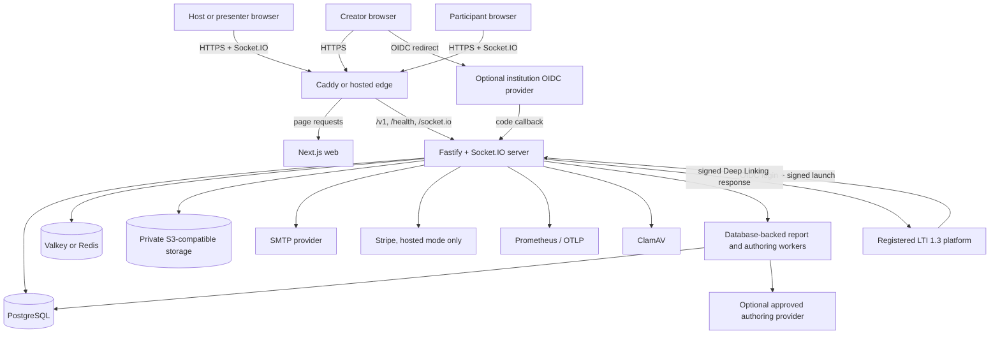
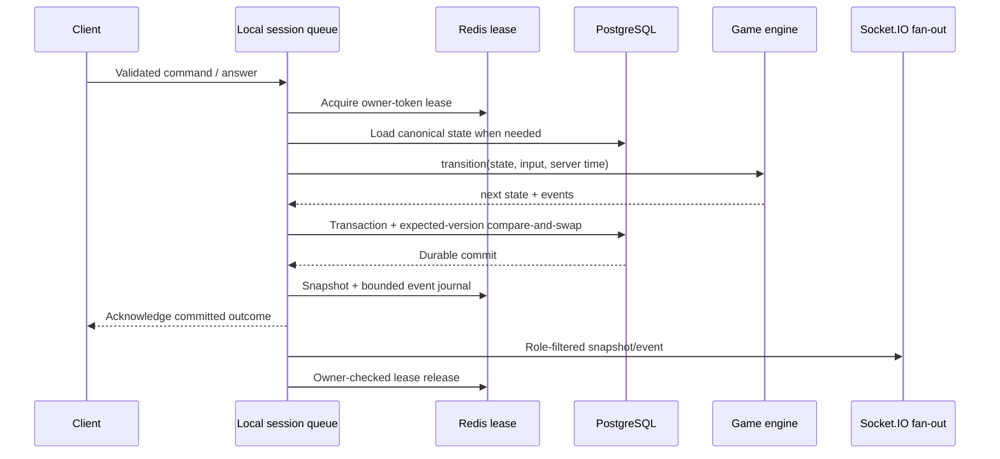
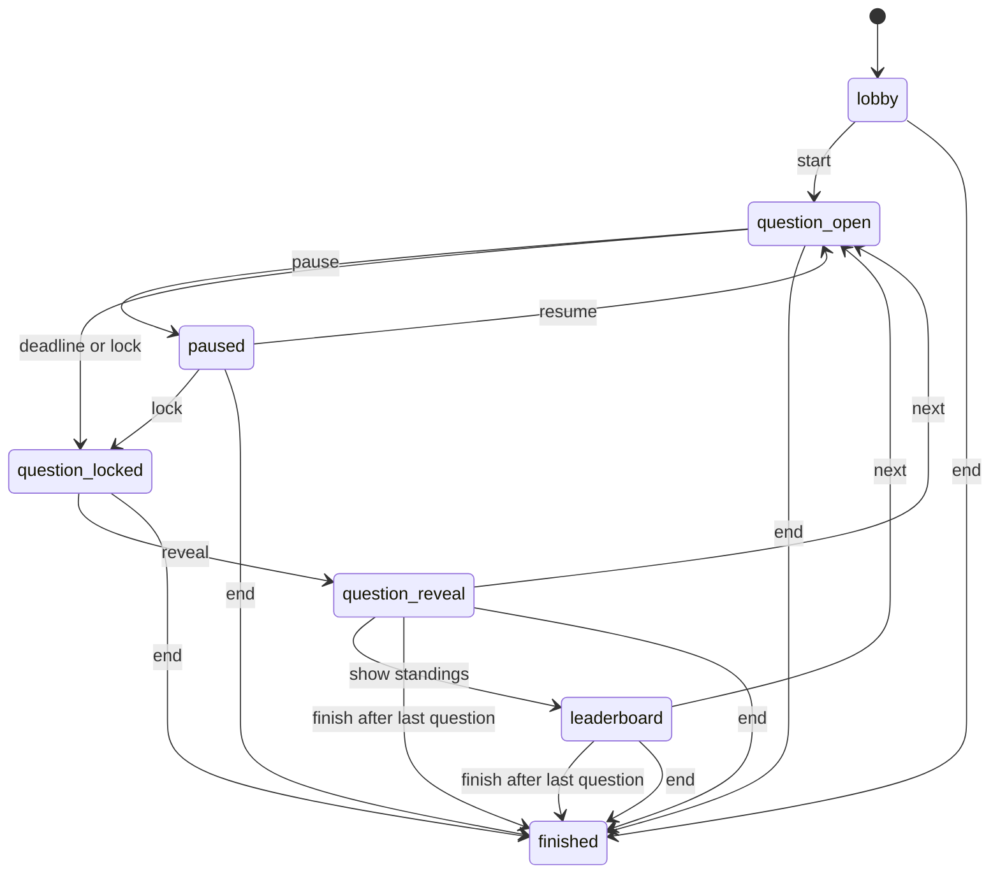
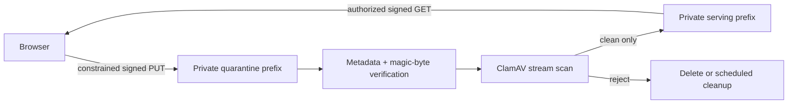

# OpenRound architecture and protocol

This document describes the implemented differentiated-product architecture, its correctness
boundaries, and the gates for production scale. OpenRound is a TypeScript modular monolith with
separately deployable web and API/realtime processes. PostgreSQL is the durable source of truth;
Redis-compatible storage accelerates active sessions and coordinates writers. The core domain is
the accountless Recovery Loop: ask, diagnose, intervene, recheck, and prove.

Read the [implementation status](implementation-status.md) for verified and outstanding release work. Architecture intent is not a substitute for production readiness evidence.

## System context



The browser receives all public pages from Next.js. Fastify owns versioned REST routes, authentication, webhooks, reports, retention, administrative endpoints, and health/metrics. Socket.IO shares the same server process and owns live joins, host commands, answer acknowledgements, snapshots, and broadcasts.

## Repository structure

| Path                   | Responsibility                                                                                                                                                 |
| ---------------------- | -------------------------------------------------------------------------------------------------------------------------------------------------------------- |
| `apps/web`             | Next.js creator, collaboration, host/cohost, presenter/embed, participant, Q&A, report, practice, institution-linking, policy, pricing, and account interfaces |
| `apps/server`          | Fastify, Socket.IO, auth/OIDC/LTI, sessions, Q&A, report/authoring workers, practice, portability, storage, billing, retention, metrics, and tracing           |
| `packages/contracts`   | Shared Zod schemas, public DTOs, realtime envelopes, commands, acknowledgements, and stable error codes                                                        |
| `packages/game-engine` | Pure state transitions, scoring, deadlines, ranking, and role-filtered snapshot projection                                                                     |
| `packages/insights`    | Pure deterministic diagnostic measurements and facilitator recommendation rules                                                                                |
| `packages/experience`  | Immutable preset registry, semantic-token validation, brand layering, and contrast checks                                                                      |
| `packages/db`          | Repository interface, PostgreSQL implementation, in-memory development implementation, and migrations                                                          |
| `infra`                | Caddy routing, PostgreSQL runtime role initialization, and Cloud Run/Fly deployment profiles                                                                   |
| `tests`                | Browser, integration, smoke, multi-writer, restart/recovery, and load scenarios                                                                                |

The application follows one domain model and one release train. Splitting web and realtime deployment does not create independent business services or databases.

## Component responsibilities

### Next.js web

- Renders public, creator, live, and reporting surfaces.
- Saves and renders mutable drafts in a participant-style preview without creating a live session.
- Creates and reviews source-grounded authoring jobs without allowing model output to publish.
- Presents segment-seeded session settings before requesting a room code or host credential.
- Calls `/v1` APIs with creator cookies or session-scoped credentials as required.
- Stores host and participant resume credentials in tab-scoped `sessionStorage`.
- Uses shared contracts for response and event shapes.
- Renders the complete public question and labels on participant devices.
- Keeps Audience Pulse, chat, Q&A, intervention/recheck, practice, collaboration, portability,
  and secure embed flows role-specific and accessible.
- Converts only validated experience tokens into CSS variables and applies device-local contrast,
  motion, and mute preferences last.
- Uses same-origin `/v1` and `/socket.io` routes by default, while allowing an explicit API origin
  at image build time for split hosted deployments.
- Generates a per-request script nonce and enforced Content Security Policy, serves HSTS and other
  browser hardening headers, and dynamically renders pages so Next.js can apply the nonce to its
  runtime scripts. Inline styles remain permitted for the constrained React style properties used
  by the P0 interface.

The web process does not decide deadlines, answer acceptance, score, rank, or session phase.

### Fastify and Socket.IO server

- Validates environment, HTTP input, event input, and webhook input at boundaries.
- Issues and verifies creator, host, and participant credentials.
- Coordinates game mutations through `SessionService`.
- Runs Audience Pulse, chat, Q&A, and practice services outside the canonical live-game snapshot.
- Persists accepted answers and canonical state before acknowledgement.
- Produces role-filtered snapshots and queues versioned reports from durable evidence.
- Claims report and authoring jobs with database leases and retry/failure state.
- Applies feature flags, plan/operator limits, rate limits, retention, and audited administration.
- Separates process liveness from dependency readiness; the ready probe performs database and
  Redis reads and returns 503 without exposing connection details when either dependency fails.

### Game engine

The game engine is a pure transition module. A transition receives current state, a command, and
server-controlled time, then returns next state and domain events. Main, linked-recheck, revote,
and intervention states are guarded transitions. The engine has no network or database dependency,
which makes arbitrary command sequences, deadlines, scoring boundaries, recovery branches, and
replay behavior testable without a running server. Historical answers stay in PostgreSQL rather
than accumulating in the active state snapshot.

### PostgreSQL

PostgreSQL stores creator identity, workspaces, roles/invitations, magic links, creator sessions,
checkpoint-set drafts, immutable versions, folders/tags, media metadata, live sessions,
round/intervention evidence, accepted canonical responses and confidence, Audience Pulse, chat,
Q&A, staff credentials, transactional audience outbox records, versioned report jobs, self-paced
recovery follow-ups and standalone assignments, authoring jobs, subscriptions, consent,
institution policies, external identity links,
LTI registrations/launches, and audit events.

Ordered transactional migration files are tracked in `_openround_migrations` with version, name,
checksum, and application time. An advisory lock serializes migration execution; startup fails when
an applied file's checksum changes. The baseline safely records a legacy P0 database before
applying later migrations.

When a live round finishes, the session update and interaction-write cutoff commit in the same
database transaction. The report worker therefore reads a closed interaction set; late Pulse,
chat, reaction, report, settings, and moderation mutations are rejected.

Durable state owns correctness. A Redis loss can reduce replay efficiency or stop coordinated writes, but it must not erase an acknowledged answer.

### Valkey or Redis

Redis-compatible storage provides:

- Active-session snapshots with expiry
- Bounded per-session Streams journals for reconnect replay
- Seven-digit code reservation
- Owner-token mutation leases
- Socket.IO cross-process delivery and transport recovery

These records are pseudonymous operational state and are not the canonical system of record.

### Private object storage and scanner

Question media is uploaded directly to a private quarantine prefix with a constrained signed URL. The server verifies metadata and magic bytes, scans the stream with ClamAV, and promotes only clean objects. Reads require creator ownership or a session-bound credential and return short-lived signed URLs.

### External services

- SMTP sends single-use creator magic links. Local Compose uses Mailpit instead of external delivery.
- Stripe Checkout, portal, and signature-verified webhooks are enabled only in hosted billing mode.
- An optional operator-approved OpenAI-compatible endpoint receives only bounded authoring source
  sections. It is disabled by default and is not used during a live round.
- Optional generic OIDC supports explicitly linked creator identities. It is disabled by default;
  a workspace policy and deployment provider configuration are both required.
- Optional LTI 1.3 supports registered-platform instructor launch and Deep Linking. Its private
  signing key remains in the secret manager; OpenRound publishes only a public JWKS.
- Prometheus metrics remain on the internal server route; optional OpenTelemetry exports spans over OTLP/HTTP.
- Checked-in collector and Alertmanager templates define the production signal and severity-route
  contract, but receiver credentials and proof of human delivery remain environment-owned.

## Primary data flows

### Creator authentication

```mermaid
sequenceDiagram
  participant B as Browser
  participant S as Server
  participant D as PostgreSQL
  participant M as SMTP / Mailpit

  B->>S: POST /v1/auth/magic-link
  S->>D: Store hashed, expiring one-time token and consent
  S->>M: Send public callback URL
  B->>S: GET /v1/auth/verify?token=...
  S->>D: Consume token; create creator session
  S-->>B: HttpOnly creator cookie + redirect
```

Raw magic-link and creator-session tokens are not stored as plaintext. Hosted production refuses
to start with sign-ups enabled unless SMTP is configured, and public origins plus creator cookies
must use HTTPS and secure attributes. The explicit private-LAN HTTP exception is limited to
non-billing community operation.

### Institution creator identity and LTI

OIDC uses authorization code with PKCE, state, and nonce. The one-time transaction stores only a
state hash plus the short-lived verifier and nonce. Link mode requires the same signed-in creator
and workspace when the callback returns. Login mode accepts only a previously linked
workspace/provider/issuer/subject tuple; a matching email claim is only a display hint and never
links an account.

```mermaid
sequenceDiagram
  participant C as Existing creator
  participant S as OpenRound
  participant D as PostgreSQL
  participant I as Institution IdP

  C->>S: Start explicit link for workspace
  S->>D: Store hashed one-time state + PKCE + nonce
  S-->>C: Authorization URL
  C->>I: Authenticate
  I-->>S: Authorization-code callback
  S->>I: Code + verifier; validate issuer/state/nonce
  S->>D: Bind issuer + subject to signed-in creator
```

LTI third-party login resolves exactly one active operator registration, then stores hashed state
and nonce. The form-post launch consumes state before validation and verifies platform signature,
issuer, audience/authorized party, nonce, deployment, version, message type, signed target, and
role. An unknown instructor subject receives a short-lived explicit-link token in a URL fragment;
it is never auto-linked by email. Deep Linking accepts only a published checkpoint set, only an
`ltiResourceLink`, and only a return origin registered by the operator. The signed response is
stored and returned idempotently on retry.

Institution policies cannot be self-enabled by owners. Database and public-contract constraints
keep K–12 false, require managed SSO before SCIM can be flagged, and require LTI plus institution
identity before NRPS/AGS can be flagged. This release still blocks learner LTI launches and does
not implement roster or grade services; those flags are contract-state preparation, not usable
features. See the [institution integration guide](institution-integrations.md).

### Author and publish

The creator updates a mutable checkpoint-set draft. Opening participant preview first persists that
draft, then renders its checkpoints and answer reveal locally without creating a session or
exposing it to guests. Publish validates response-type rules, confidence/purpose constraints, and
acyclic recheck links, inserts a new immutable `quiz_versions` record, and points the legacy quiz
record at that version. Existing table names, IDs, URLs, and `/v1/quizzes` APIs intentionally
remain compatible. Session creation resolves and stores the current version, so later draft edits
cannot change a running game.

Native JSON, CSV, bulk text, and a constrained QTI 3 package flow through bounded validators before
creating a draft. Archive and XML readers enforce path, entry, expansion, compression, entity,
remote-reference, and media limits. Imports return errors/warnings instead of silently discarding
unsupported content; CSV output escapes formula prefixes.

### Source-grounded authoring

```mermaid
sequenceDiagram
  participant C as Creator
  participant S as Server
  participant D as PostgreSQL
  participant W as Isolated extraction worker
  participant A as Approved provider

  C->>S: Paste text or upload PDF/DOCX/PPTX
  S->>D: Store private pending job + source digest
  W->>D: Claim with lease / SKIP LOCKED
  W->>W: Enforce file, archive, XML, page, time, memory, and text limits
  W->>A: Bounded source sections only
  A-->>W: Structured proposal + exact citations
  W->>W: Validate schema, links, answers, and citation grounding
  W->>D: Store proposal; clear source bytes
  C->>S: Explicitly create review draft
  S->>D: Idempotently create one unpublished checkpoint set
```

The provider never receives participants, responses, sessions, reports, or Q&A. Provider failure
retries three times; extraction/security failure stops immediately. Ready and terminal jobs clear
the submitted source while retaining its digest and cited proposal until retention purges the job.
Creator review and normal publication remain mandatory.

### Recovery evidence and report jobs

Round state stores only current indexes and aggregates. PostgreSQL owns historical accepted
responses, confidence, round kind, intervention links, and timing. `packages/insights` derives
deterministic measurements and recommendation explanations without network or model calls.

Finishing a session inserts a versioned pending report. A database worker claims it with
`FOR UPDATE SKIP LOCKED`, retries transient failure, and reconstructs report v3 from durable rows.
Linked recovery and revote improvement use separate evidence types. Older report schemas remain
renderable; new report creation targets 60 seconds.

### Q&A and scoped session staff

Q&A is persisted outside the game snapshot so conversation traffic cannot enlarge or corrupt the
authoritative round state. Questions, replies, votes, moderation state, aliases, and audit actors
are workspace/session scoped. Unique votes, sanitization, independent limits, cursor pagination,
and realtime events support moderation. Cohost and presenter credentials are separately hashed,
revocable, role-scoped records; the presenter never reuses the host token.

### Round Experiences and Audience Pulse

`packages/experience` is the only registry for the six versioned presets. Drafts and immutable
exports carry category plus preset reference. Session creation resolves published preset, optional
host override, eligible workspace branding, and sound preference into a validated theme snapshot
stored in game state v4. The v3 upgrader supplies Focus for restored active sessions; future state
versions fail closed. Reconnect and process recovery therefore cannot pick up later draft or
branding changes.

Audience interaction uses a sequence independent from the authoritative game sequence. Signal,
chat, reaction, settings, and moderation mutations run in one PostgreSQL transaction that:

1. Validates the session-scoped participant or staff credential and distributed limits.
2. Updates durable interaction state.
3. Allocates a monotonic `audience_seq` under the session interaction-settings lock.
4. Inserts a uniquely identified outbox event.
5. Commits before returning the acknowledgement.

The outbox relay claims events with `FOR UPDATE SKIP LOCKED` and publishes through Socket.IO/Redis.
Delivery is at least once; clients deduplicate by event ID and request `audience.sync.request` after
a sequence gap. Synchronization returns current settings, role-filtered recent messages, aggregate
signals, the requesting participant’s own signal, and moderation state. It never replays removed
content.

Private-alias safety is historical, not merely a current setting: each chat row stores the identity
mode at creation. Moderator projection retains the session alias while all other roles permanently
receive **Anonymous** for a message created privately. Individual Pulse projection is host/cohost
only; public aggregate counts remain null below five unique signalers.

### Create and join a session

1. The creator opens setup for a published quiz. The web UI seeds audience, scoring, result,
   late-join, nickname, and experience settings from the creator segment, immutable version, and
   current entitlements.
2. After the creator confirms the settings, the browser requests a session. Merely opening setup
   does not reserve a code or issue a host credential.
3. The server validates every setting and checks the hosted plan or community operator limit.
4. It reserves a seven-digit code in Redis with the session ID as owner.
5. It inserts the session in PostgreSQL; the partial unique index on active codes is the final collision backstop.
6. It returns the host credential once and stores only its hash.
7. Guest joins are admitted in a short deterministic per-session batch. Capacity, lobby state,
   nickname policy, avatar allowlist, and uniqueness are evaluated against one evolving state.
   Once the participant UUID is allocated, an omitted avatar receives a deterministic fallback
   from the same fixed allowlist.
8. Participant rows and the final session snapshot commit atomically. The selected or fallback
   avatar is stored in canonical game state, and each accepted guest receives a resume credential
   whose hash is persisted.

`JoinRequest.avatarId` is optional for backward compatibility and accepts only `comet`, `fox`,
`owl`, `otter`, `panda`, `robot`, `rocket`, or `star`. Existing state schema v4 snapshots without
the additive field are normalized deterministically when loaded, while newer snapshots preserve
the chosen value through reconnect, host/presenter projection, moderator audience summaries, and
report generation. Reconnect authenticates the existing participant and cannot change its avatar.

There is intentionally no normalized participant avatar column. The canonical session snapshot is
already committed atomically with participant credential/status rows and supplies live,
reconnect, audience, and report projections. Duplicating the avatar in the participant table would
require a backfill and dual-write consistency without supporting a current independent query.
Introduce a column only if a later feature must query avatars without loading canonical session
state.

The host and presenter derive a prefilled `/join?code=...` URL from the configured public web URL
or the browser's reachable non-loopback origin. The QR code is only another encoding of that URL;
all participants still join through the same validated REST/realtime flow and receive independent
credentials.

Failed session creation releases only its own code reservation. Finished or explicitly deleted
sessions release their codes early; otherwise the reservation expires with the 24-hour live-session
window. Live expiry rejects further credential use and releases the durable active-code record
without deleting report data.

### Host command or answer mutation



Every mutation first enters an in-process per-session queue, then acquires a short Redis owner-token lease. Renewal and release use owner-checking scripts, so an expired writer cannot extend or remove a successor's lease. PostgreSQL compares the expected session version on every state write; this is the durable fencing backstop when a lease expires, Redis fails over, or a stale process resumes.

A safe non-join mutation retries once from canonical state after a compare-and-swap conflict. Host commands that still conflict return `STALE_VERSION` and prompt a client resynchronization.

### Answer durability and batching

An accepted answer and the resulting canonical session snapshot commit in one PostgreSQL transaction before the acknowledgement is returned. Database uniqueness protects both `(participant, round)` and the answer idempotency key, so a retry returns the original outcome without a second score effect.

Answers received in the same short session window are evaluated in deterministic arrival order against one evolving state and committed as one transaction. Each answer retains its own receipt time, idempotency key, score, and sequence number. The server captures receipt time before queueing, so batch processing does not make an otherwise on-time answer late.

After the database commit, Redis receives the current snapshot and a pipelined sequence journal. A crash after durable acknowledgement but before cache append can force reconnect to use a canonical snapshot; it cannot erase or rescore the answer.

### Reconnect and replay

Clients send their last observed sequence in `sync.request`. If the bounded Redis journal contains a contiguous suffix, the service can return replay metadata and the latest role-filtered view. It always provides an authoritative snapshot so clients can recover from a missing range, process restart, or cache loss.

That authoritative snapshot also restores the participant's session avatar. Host and presenter
projections may show every participant avatar, while a private-result participant projection keeps
the requesting participant's avatar and suppresses avatars belonging to everyone else.

Intentional realtime-process shutdown avoids converting every attached guest into a durable disconnect mutation. Ordinary network disconnects still update presence through the guarded session queue.

### Report, practice, export, and deletion

Finishing a session stamps a purge deadline from the then-active plan and queues report generation
from durable participant, answer, intervention, Pulse, chat, moderation, and Q&A rows. Hosted Free
retains the full session tree for 30 days; hosted Pro/Team retains it for 365 days; community
operators configure their own duration. A later downgrade does not shorten an existing deadline.
Versioned JSON and formula-safe UTF-8 CSV are server-enforced for the entitled edition.

A Pro/community facilitator may select unresolved concepts and create one immutable self-paced
recovery follow-up. An allowlisted facilitator may also create a standalone practice assignment
from the Round's current published version. Both kinds retain that immutable source-version ID;
standalone practice clones main questions only and has no source session or report. The service
hashes generic, personal, accommodation, and resume tokens; server time owns timed attempts while
flex mode has no countdown. Answers remain idempotent and durable. Recovery rows reference the
source session with cascading deletion and cannot outlive its retention window. Standalone rows use
the plan retention duration captured at creation and are purged directly at their stored expiry.

Scheduled retention closes expired live/practice access, directly purges expired standalone
assignments, removes expired authoring jobs, then cascades session deletion at the stored deadline.
Explicit session deletion removes the same tree,
including interaction state and outbox rows, and invalidates active cache. Account export gathers
collaboration, Pulse, chat, moderation, Q&A, recovery, follow-up, and authoring/institution data
while excluding bearer hashes and LTI response JWTs; account deletion removes or anonymizes owned
records and private objects according to the repository workflow. An
approved institution owner can separately export up to 10,000 ordered audit events with explicit
truncation and workspace home-region metadata.

One entitlement policy supplies API enforcement and UI capability data. Hosted Free receives 20
participants, five published checkpoint sets, 30-day reports, aggregate Recovery Loop/Q&A, and
three authoring jobs. Hosted Pro receives 100 participants, unlimited sets, exports/QTI, follow-up,
cohosting, one workspace theme, 365-day reports, and 100 authoring jobs. Community mode removes
application paywalls while preserving operator-configured participant, retention, and provider
ceilings.

A workspace brand contains an organization name plus primary and accent hexadecimal colours. The
shared contract requires both colours to maintain at least 4.5:1 contrast with white text, and the
server revalidates every update. Session creation layers the entitled brand over the selected
versioned preset and copies the resolved semantic tokens into canonical game state. This makes the
experience stable across host, presenter, participant, reconnect, and process-loss paths even if
the workspace brand changes later. CSS receives only schema-constrained values; arbitrary style
text is never accepted.

## Game invariants

- Exactly one round may be open.
- A round is `main`, `linked_recheck`, or `revote`; rechecks default to unscored and a recovery
  branch completes before standings or the next main checkpoint.
- Peer discussion precedes reveal; explanation, example, and break interventions follow reveal.
- Session version and event sequence are monotonic.
- A host transition applies once per `commandId` and only against `expectedVersion`.
- A participant receives at most one accepted answer and score effect per round.
- A repeated answer `idempotencyKey` returns the original acknowledgement.
- Legacy `choiceId` input canonicalizes to the versioned response payload; durable uniqueness
  remains participant + round and idempotency key.
- Server receipt time and deadline determine acceptance; the rendered countdown is advisory.
- Published quiz versions are immutable, and running sessions retain their frozen version.
- Open-checkpoint payloads omit correctness, explanation, misconception metadata, source
  citations, distributions, and score outcome.
- Participant snapshots reveal only that participant's private result in private-result mode and
  suppress other participants' avatars while preserving the requesting participant's own avatar.
- Ties resolve by correct-answer count, aggregate accepted response time, then stable participant ID.

Speed scoring for a correct response is:

```text
round(basePoints × (0.60 + 0.40 × max(0, 1 − elapsed ÷ limit)))
```

Accuracy mode awards the full base points for a correct response.

## State transitions



Lobby locking controls admission and does not remove existing participants. Late joining is evaluated separately from the current phase.

## Public protocol

REST routes are versioned under `/v1`. Socket.IO messages use a shared envelope carrying session identity, version, sequence, type, schema version, server time, and validated payload. Host commands include a unique command ID and expected version; answers include a unique idempotency key.

Question IDs, host command IDs, and answer idempotency suffixes are non-secret UUID v4 values
generated with browser Web Crypto random bytes. The helper does not depend on
`crypto.randomUUID()`, which browsers withhold from non-localhost HTTP origins, so trusted-LAN
development remains functional. Host and participant credentials are separate server-generated
secrets.

Required client messages are `session.join`, `answer.submit`, `host.command`, and `sync.request`.
Principal server messages are `lobby.updated`, `question.open`, `question.locked`,
`question.reveal`, `leaderboard.updated`, `session.snapshot`, and `game.finished`. Q&A uses
`qna.question.*`, `qna.reply.*`, and `qna.vote.updated` notifications; durable REST responses remain
the acknowledgement boundary.

The separate sequenced audience stream emits `audience.settings.updated`, host-only
`audience.signal.updated`, coalesced `audience.summary.updated`, `chat.message.*`,
`chat.reaction.updated`, and `audience.moderation.updated`. During the Q&A compatibility release,
durable Q&A changes also use the same cursor through `audience.event` while legacy direct `qna.*`
notifications remain available. Its sync request and cursor are separate from game-state replay so
interaction load cannot affect scoring correctness.

Stable errors include `INVALID_CODE`, `SESSION_FULL`, `SESSION_LOCKED`, `NICKNAME_REJECTED`, `STALE_VERSION`, `ANSWER_LATE`, `ANSWER_INVALID`, `ENTITLEMENT_LIMIT`, `UNAUTHORIZED`, and `RATE_LIMITED`. See the [API and realtime reference](api.md) for endpoint, credential, and payload details.

## Security and tenancy boundaries

### Credentials and authorization

- Creator access uses an HttpOnly session cookie issued after a single-use email link.
- Generic OIDC can establish the same creator session only after explicit issuer/subject linking;
  unknown identities and removed workspace memberships are rejected.
- LTI instructor access uses verified platform launch claims and an explicit first-link step. Tool
  signing keys are private, public JWKS contain no private RSA parameters, and learner launches are
  blocked until the identified-participant model is approved and implemented.
- Host, cohost, presenter, participant, embed, follow-up, accommodation, and authoring access are
  distinct scopes. Bearer credentials are random, returned only where required, hashed at rest,
  and redacted from structured logs.
- Every creator resource lookup is scoped to its workspace.
- Realtime synchronization projects state for `host`, `presenter`, or the individual participant role.
- State-changing browser requests accept the configured web origin or a request that is genuinely
  same-origin with the public proxy host. This permits a LAN address behind Caddy without accepting
  unrelated browser origins. Routes and events enforce size, schema, role, and rate limits.
- Browser documents enforce nonce-authorized scripts, deny script attributes, objects, frames, and
  foreign form actions, and upgrade insecure requests on HTTPS deployments. HTTPS image and
  connection schemes remain broad until final storage/API origins are fixed and independently
  reviewed; explicitly permitted private-network HTTP community deployments also allow HTTP and
  WebSocket resources so multi-device LAN operation remains functional.

### PostgreSQL row-level security

Tenant tables use forced PostgreSQL row-level security. Request repositories open a transaction
and set transaction-local `app.workspace_id`; authentication, retention, billing webhook, and
deletion operations use explicit system scope where required. Production traffic must use a
non-owner database role. A separate privileged `DATABASE_MIGRATION_URL` is used only by the
published image's one-shot `node dist/migrate.js` command and must not be exposed to request
handling.

### Media trust boundary



The browser cannot choose an arbitrary bucket key or make an object public. Account deletion and scheduled quarantine cleanup include blob deletion and cache invalidation paths.

### Document and AI trust boundary

Uploaded authoring files remain private database job data while processing. Extraction happens in
a memory-bounded worker with file, archive, expansion, compression, page, XML, text, and timeout
limits. Office extraction reads only expected document/slide XML and rejects declarations/entities;
PDF extraction does not fetch remote URLs. The provider endpoint is operator-configured, disallows
redirects, has a request deadline and 2 MB response ceiling, and must use HTTPS in production
unless an explicit private community-network exception applies. Output must pass shared content
schemas and exact citation grounding before it is saved.

## Deployment topologies

### Local community profile

`compose.yaml` runs Caddy, web, one API/realtime process, PostgreSQL, Valkey, MinIO, and Mailpit. `compose.media.yaml` adds ClamAV. Caddy serves the product on one origin and routes `/v1/*`, `/health/*`, and `/socket.io/*` to the server.

The default browser API URL is relative, so opening Caddy through a reachable LAN address keeps
page, REST, and Socket.IO traffic on that address. `OPENROUND_PUBLIC_URL` defines the canonical QR,
redirect, and email-link origin. Cross-device direct media delivery additionally requires a
reachable `OPENROUND_STORAGE_URL` and an explicit non-loopback `OPENROUND_STORAGE_BIND`.

Community mode disables application billing gates and lets the operator configure the participant ceiling, up to the supported P0 ceiling. The included configuration and credentials are development examples, not internet-safe defaults.

### Hosted regional profile

The launch topology uses separately deployable web and always-on API/realtime containers with one active realtime writer, a regional PostgreSQL database, private object storage, and regional managed Redis. The Canadian and later US stacks are isolated. Each workspace has an immutable home region; existing Canadian workspaces are never moved automatically.

A future global code directory may contain only code, region, and expiry. Direct links and QR codes carry the regional host so participant traffic stays within the workspace's region.

### Horizontal scale gate

The code includes per-session Redis leases, PostgreSQL compare-and-swap fencing, the Redis Streams Socket.IO adapter, canonical snapshot fallback, and local two-writer/process-loss tests. One active realtime process remains the conservative hosted default until the target provider passes all of these gates:

1. Sticky routing is verified for every enabled Socket.IO transport through the real load balancer.
2. Reconnect, replay, duplicate command/answer, lease expiry, rolling deploy, and process-kill tests pass with 250 regional clients.
3. Managed Redis failover is exercised while monitoring lease, version-conflict, acknowledgement, and replay-fallback signals.
4. Every session is proven to route only within its immutable home region.

## Failure behavior

| Failure                              | Expected behavior                                                                                                                                              |
| ------------------------------------ | -------------------------------------------------------------------------------------------------------------------------------------------------------------- |
| Browser network interruption         | Client shows reconnecting state, reconnects, and requests an authoritative role-filtered snapshot.                                                             |
| Duplicate answer retry               | Database/idempotency lookup returns the first acknowledgement; score is not applied twice.                                                                     |
| Duplicate or stale host command      | Previously applied command is idempotent; incompatible expected version returns `STALE_VERSION` and triggers sync.                                             |
| Realtime process loss                | A surviving process can load canonical state; cache-journal gaps fall back to a snapshot.                                                                      |
| Redis unavailable                    | Production coordination is unhealthy and readiness should fail rather than silently allowing uncoordinated writers. Durable PostgreSQL data remains canonical. |
| Object fails validation or scanning  | Object is not promoted or served; cleanup removes rejected/quarantined content according to policy.                                                            |
| Billing webhook retry                | Signature and provider event identity are checked; processing is idempotent before entitlement changes.                                                        |
| Report worker/process loss           | Expired leases make pending jobs claimable again; durable evidence remains unchanged.                                                                          |
| Authoring extraction rejected        | Job fails without calling the provider and private source bytes are cleared.                                                                                   |
| Authoring provider interruption      | The job retries with bounded backoff, fails after three attempts, and never creates or publishes content automatically.                                        |
| Duplicate authoring apply            | A row lock and stored applied checkpoint-set ID return the first unpublished draft instead of creating another.                                                |
| Replayed OIDC or LTI state           | Atomic one-time consumption rejects the callback/launch; no creator session or identity link is issued.                                                        |
| Unknown federated identity           | OpenRound rejects login and requires email authentication plus an explicit link in the same workspace.                                                         |
| Changed or disabled LMS registration | New launches fail; an already verified launch remains short-lived and workspace scoped.                                                                        |

## Operations boundary

Structured logs redact authorization, cookies, tokens, nickname, and email fields. Fastify assigns or accepts a request ID and exposes request/trace IDs only to authorized origins. Process-local Prometheus metrics are served from `/metrics`; the included public Caddy route does not expose it. Optional OpenTelemetry instrumentation emits correlated HTTP, Fastify, and game-operation spans over OTLP/HTTP. Authoritative server events request an immediate, data-free browser acknowledgement; bounded event/role/outcome histograms measure receipt round trips and timeouts without exposing session or participant identifiers or trusting device clocks.

Startup feature switches for signup, session creation, media upload, Round Experiences, Audience
Pulse, and room chat are hard ceilings. An `ADMIN_TOKEN`-protected API updates shared PostgreSQL
runtime switches without a restart; every guarded request reads the shared state, and the update
plus global audit record commit in one transaction. A workspace UUID allowlist supports the
design-partner stage. Runtime switches cannot enable missing infrastructure or override a disabled
startup ceiling, and they do not interrupt active games. Retention runs on an interval in the
server process. Production promotion also requires external uptime checks, centralized
logs/metrics, alert routing, backup verification, and operator ownership; see the
[observability](runbooks/observability.md) and
[production readiness](runbooks/production-readiness.md) runbooks.

## Key decisions and tradeoffs

| Decision                           | Benefit                                                                | Cost or constraint                                                                        |
| ---------------------------------- | ---------------------------------------------------------------------- | ----------------------------------------------------------------------------------------- |
| Modular monolith                   | One model, transaction boundary, and release train for a small team    | Components cannot be scaled or released as independent services without later extraction  |
| Pure game engine                   | Deterministic tests and no infrastructure coupling                     | Orchestration must translate engine events into persistence and role-filtered transport   |
| PostgreSQL as source of truth      | Durable acknowledgements, reports, tenancy, and recovery in one system | Every accepted answer reaches durable storage before acknowledgement                      |
| Redis for coordination, not truth  | Fast leases, replay, codes, and fan-out without risking durable loss   | Production realtime requires Redis health and provider-specific failover testing          |
| Immutable quiz versions            | Running sessions cannot change underneath participants                 | Creators must republish edits for future sessions                                         |
| Session-scoped guests              | Low-friction joining and reduced child/privacy surface                 | No cross-session learner history or roster identity in P0                                 |
| Q&A outside game state             | Conversation traffic and moderation do not bloat live snapshots        | Q&A requires its own persistence, limits, retention, and realtime events                  |
| Audience outbox outside game state | Durable chat/Pulse acknowledgements and cross-process fan-out          | At-least-once delivery requires event deduplication and separate audience synchronization |
| Frozen semantic experience tokens  | Consistent accessible visuals across roles and process restoration     | Preset revisions require explicit versions; arbitrary theme code is unsupported           |
| Database-backed background jobs    | Reports and authoring survive process loss and retry safely            | Job latency and exhausted failures require operator monitoring                            |
| Human-reviewed authoring AI        | Citations and draft-only output reduce ungrounded publishing risk      | Provider quality/cost still require evaluation; human verification remains mandatory      |
| One regional home per workspace    | Clear residency and routing boundary                                   | Cross-region migration and global sessions are deferred                                   |
| One launch realtime process        | Lower early operational risk                                           | Horizontal capacity waits on sticky-session and failure testing                           |

## Implementation map

- Shared contracts: [`packages/contracts/src/index.ts`](../packages/contracts/src/index.ts)
- Pure transitions and projections: [`packages/game-engine/src/index.ts`](../packages/game-engine/src/index.ts)
- Session orchestration: [`apps/server/src/session-service.ts`](../apps/server/src/session-service.ts)
- REST routes: [`apps/server/src/routes.ts`](../apps/server/src/routes.ts)
- Realtime transport: [`apps/server/src/realtime.ts`](../apps/server/src/realtime.ts)
- Redis coordination/replay: [`apps/server/src/cache.ts`](../apps/server/src/cache.ts)
- PostgreSQL repository: [`packages/db/src/postgres.ts`](../packages/db/src/postgres.ts)
- Schema and RLS: [`packages/db/migrations/001_initial.sql`](../packages/db/migrations/001_initial.sql)
- Ordered migration runner: [`packages/db/src/migrations.ts`](../packages/db/src/migrations.ts)
- Deterministic insights: [`packages/insights/src/index.ts`](../packages/insights/src/index.ts)
- Experience registry: [`packages/experience/src/index.ts`](../packages/experience/src/index.ts)
- Report worker: [`apps/server/src/report-worker.ts`](../apps/server/src/report-worker.ts)
- Q&A service: [`apps/server/src/qna-service.ts`](../apps/server/src/qna-service.ts)
- Audience interaction service: [`apps/server/src/interaction-service.ts`](../apps/server/src/interaction-service.ts)
- Audience outbox relay: [`apps/server/src/audience-outbox-worker.ts`](../apps/server/src/audience-outbox-worker.ts)
- Follow-up service: [`apps/server/src/followup-service.ts`](../apps/server/src/followup-service.ts)
- Portability and QTI: [`apps/server/src/portability.ts`](../apps/server/src/portability.ts),
  [`apps/server/src/qti.ts`](../apps/server/src/qti.ts)
- Authoring assistant/worker: [`apps/server/src/authoring-assistant.ts`](../apps/server/src/authoring-assistant.ts),
  [`apps/server/src/authoring-worker.ts`](../apps/server/src/authoring-worker.ts)
- Institution identity and LTI: [`apps/server/src/oidc-service.ts`](../apps/server/src/oidc-service.ts),
  [`apps/server/src/lti-service.ts`](../apps/server/src/lti-service.ts)
- Local topology: [`compose.yaml`](../compose.yaml)
- Deployment configuration preflight: [`apps/server/src/config-check.ts`](../apps/server/src/config-check.ts)
- Web CSP boundary: [`apps/web/proxy.ts`](../apps/web/proxy.ts)
- Release gates and evidence: [`docs/release-readiness.json`](release-readiness.json)

See the [product design](design.md) for role and interaction rationale and the [user guide](user-guide.md) for current workflows.
