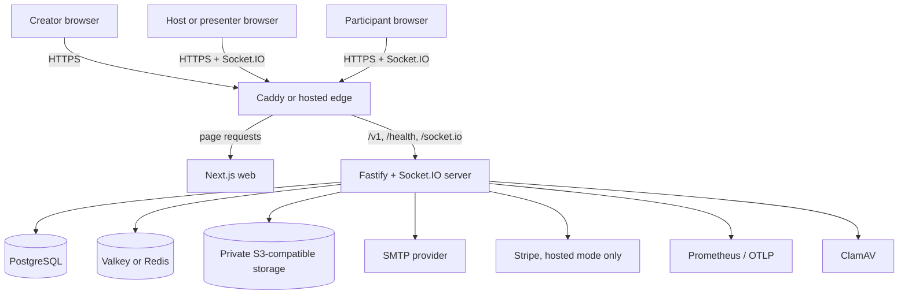
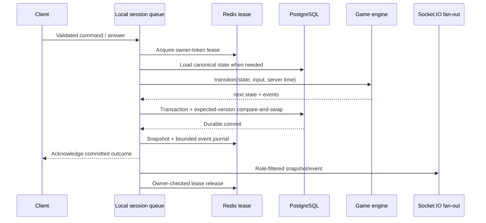
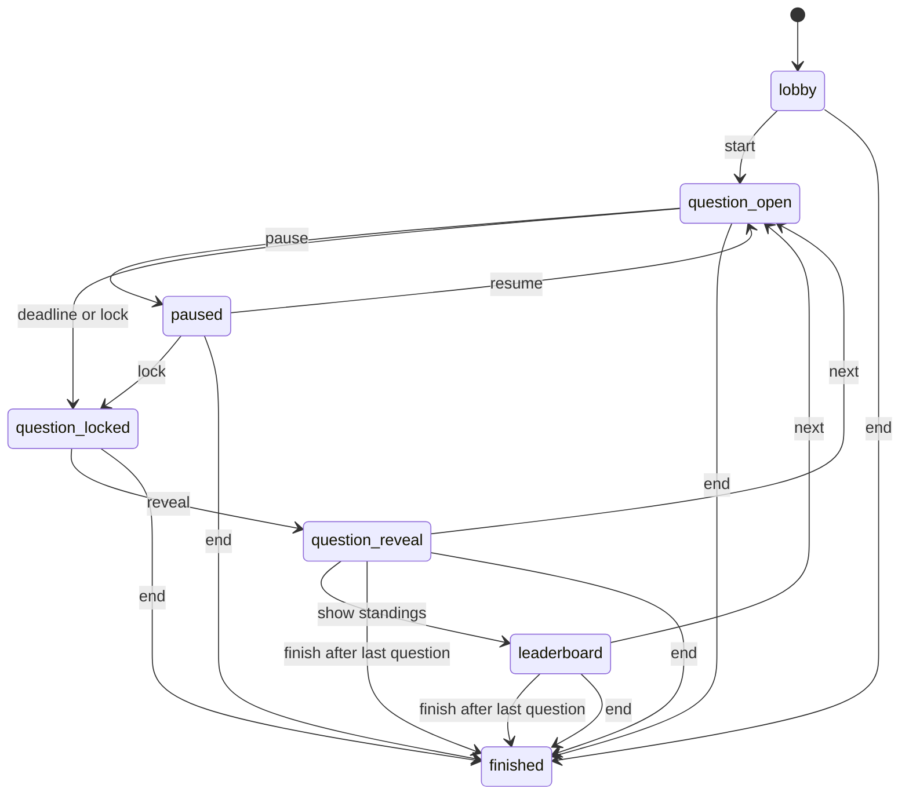
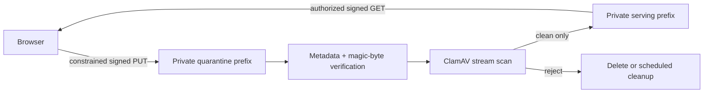

# OpenRound architecture and protocol

This document describes the implemented P0 architecture, its correctness boundaries, and the gates for production scale. OpenRound is a TypeScript modular monolith with separately deployable web and API/realtime processes. PostgreSQL is the durable source of truth; Redis-compatible storage accelerates active sessions and coordinates writers.

Read the [implementation status](implementation-status.md) for verified and outstanding release work. Architecture intent is not a substitute for production readiness evidence.

## System context



The browser receives all public pages from Next.js. Fastify owns versioned REST routes, authentication, webhooks, reports, retention, administrative endpoints, and health/metrics. Socket.IO shares the same server process and owns live joins, host commands, answer acknowledgements, snapshots, and broadcasts.

## Repository structure

| Path                   | Responsibility                                                                                                                              |
| ---------------------- | ------------------------------------------------------------------------------------------------------------------------------------------- |
| `apps/web`             | Next.js creator, host, presenter, participant, report, policy, pricing, status, and account interfaces                                      |
| `apps/server`          | Fastify application, Socket.IO transport, auth, session orchestration, storage, scanning, billing, reports, retention, metrics, and tracing |
| `packages/contracts`   | Shared Zod schemas, public DTOs, realtime envelopes, commands, acknowledgements, and stable error codes                                     |
| `packages/game-engine` | Pure state transitions, scoring, deadlines, ranking, and role-filtered snapshot projection                                                  |
| `packages/db`          | Repository interface, PostgreSQL implementation, in-memory development implementation, and migrations                                       |
| `infra`                | Caddy routing, PostgreSQL runtime role initialization, and Cloud Run/Fly deployment profiles                                                |
| `tests`                | Browser, integration, smoke, multi-writer, restart/recovery, and load scenarios                                                             |

The application follows one domain model and one release train. Splitting web and realtime deployment does not create independent business services or databases.

## Component responsibilities

### Next.js web

- Renders public, creator, live, and reporting surfaces.
- Saves and renders mutable drafts in a participant-style preview without creating a live session.
- Presents segment-seeded session settings before requesting a room code or host credential.
- Calls `/v1` APIs with creator cookies or session-scoped credentials as required.
- Stores host and participant resume credentials in tab-scoped `sessionStorage`.
- Uses shared contracts for response and event shapes.
- Renders the complete public question and labels on participant devices.
- Uses same-origin `/v1` and `/socket.io` routes by default, while allowing an explicit API origin
  at image build time for split hosted deployments.

The web process does not decide deadlines, answer acceptance, score, rank, or session phase.

### Fastify and Socket.IO server

- Validates environment, HTTP input, event input, and webhook input at boundaries.
- Issues and verifies creator, host, and participant credentials.
- Coordinates game mutations through `SessionService`.
- Persists accepted answers and canonical state before acknowledgement.
- Produces role-filtered snapshots and reports.
- Applies feature flags, plan/operator limits, rate limits, retention, and audited administration.

### Game engine

The game engine is a pure transition module. A transition receives current state, a command, and server-controlled time, then returns next state and domain events. It has no network or database dependency, which makes arbitrary command sequences, deadlines, scoring boundaries, and replay behavior testable without a running server.

### PostgreSQL

PostgreSQL stores creator identity, workspaces, memberships, magic links, creator sessions, quiz drafts, immutable quiz versions, media metadata, game sessions, participants, rounds, accepted answers, event history, reports, subscriptions, billing events, consent, and audit events.

Durable state owns correctness. A Redis loss can reduce replay efficiency or stop coordinated writes, but it must not erase an acknowledged answer.

### Valkey or Redis

Redis-compatible storage provides:

- Active-session snapshots with expiry
- Bounded per-session Streams journals for reconnect replay
- Seven-digit code reservation
- Owner-token mutation leases
- Socket.IO cross-process delivery and transport recovery

These records are pseudonymous operational state and are not the canonical system of record.

### Private object storage and scanner

Question media is uploaded directly to a private quarantine prefix with a constrained signed URL. The server verifies metadata and magic bytes, scans the stream with ClamAV, and promotes only clean objects. Reads require creator ownership or a session-bound credential and return short-lived signed URLs.

### External services

- SMTP sends single-use creator magic links. Local Compose uses Mailpit instead of external delivery.
- Stripe Checkout, portal, and signature-verified webhooks are enabled only in hosted billing mode.
- Prometheus metrics remain on the internal server route; optional OpenTelemetry exports spans over OTLP/HTTP.

## Primary data flows

### Creator authentication

```mermaid
sequenceDiagram
  participant B as Browser
  participant S as Server
  participant D as PostgreSQL
  participant M as SMTP / Mailpit

  B->>S: POST /v1/auth/magic-link
  S->>D: Store hashed, expiring one-time token and consent
  S->>M: Send public callback URL
  B->>S: GET /v1/auth/verify?token=...
  S->>D: Consume token; create creator session
  S-->>B: HttpOnly creator cookie + redirect
```

Raw magic-link and creator-session tokens are not stored as plaintext. Hosted production refuses
to start with sign-ups enabled unless SMTP is configured, and public origins plus creator cookies
must use HTTPS and secure attributes. The explicit private-LAN HTTP exception is limited to
non-billing community operation.

### Author and publish

The creator updates a mutable quiz draft. Opening participant preview first persists that draft,
then renders its questions and answer reveal locally without creating a session or exposing it to
guests. Publish validates the complete draft, inserts a new immutable `quiz_versions` record, and
points the quiz at that version. Session creation resolves and stores the current version, so
later draft edits cannot change a running game.

### Create and join a session

1. The creator opens setup for a published quiz. The web UI seeds audience, scoring, result,
   late-join, and nickname settings from the creator segment and current entitlements.
2. After the creator confirms the settings, the browser requests a session. Merely opening setup
   does not reserve a code or issue a host credential.
3. The server validates every setting and checks the hosted plan or community operator limit.
4. It reserves a seven-digit code in Redis with the session ID as owner.
5. It inserts the session in PostgreSQL; the partial unique index on active codes is the final collision backstop.
6. It returns the host credential once and stores only its hash.
7. Guest joins are admitted in a short deterministic per-session batch. Capacity, lobby state, nickname policy, and uniqueness are evaluated against one evolving state.
8. Participant rows and the final session snapshot commit atomically. Each accepted guest receives a resume credential whose hash is persisted.

The host and presenter derive a prefilled `/join?code=...` URL from the configured public web URL
or the browser's reachable non-loopback origin. The QR code is only another encoding of that URL;
all participants still join through the same validated REST/realtime flow and receive independent
credentials.

Failed session creation releases only its own code reservation. Finished or explicitly deleted
sessions release their codes early; otherwise the reservation expires with the 24-hour live-session
window. Live expiry rejects further credential use and releases the durable active-code record
without deleting report data.

### Host command or answer mutation



Every mutation first enters an in-process per-session queue, then acquires a short Redis owner-token lease. Renewal and release use owner-checking scripts, so an expired writer cannot extend or remove a successor's lease. PostgreSQL compares the expected session version on every state write; this is the durable fencing backstop when a lease expires, Redis fails over, or a stale process resumes.

A safe non-join mutation retries once from canonical state after a compare-and-swap conflict. Host commands that still conflict return `STALE_VERSION` and prompt a client resynchronization.

### Answer durability and batching

An accepted answer and the resulting canonical session snapshot commit in one PostgreSQL transaction before the acknowledgement is returned. Database uniqueness protects both `(participant, round)` and the answer idempotency key, so a retry returns the original outcome without a second score effect.

Answers received in the same short session window are evaluated in deterministic arrival order against one evolving state and committed as one transaction. Each answer retains its own receipt time, idempotency key, score, and sequence number. The server captures receipt time before queueing, so batch processing does not make an otherwise on-time answer late.

After the database commit, Redis receives the current snapshot and a pipelined sequence journal. A crash after durable acknowledgement but before cache append can force reconnect to use a canonical snapshot; it cannot erase or rescore the answer.

### Reconnect and replay

Clients send their last observed sequence in `sync.request`. If the bounded Redis journal contains a contiguous suffix, the service can return replay metadata and the latest role-filtered view. It always provides an authoritative snapshot so clients can recover from a missing range, process restart, or cache loss.

Intentional realtime-process shutdown avoids converting every attached guest into a durable disconnect mutation. Ordinary network disconnects still update presence through the guarded session queue.

### Report, export, and deletion

Finishing a session derives report totals from durable participant and answer records and stamps a
purge deadline from the then-active plan. Hosted Free retains the full session tree for 30 days;
hosted Pro/Team retains it for 365 days; community operators configure their own duration. A later
downgrade does not shorten an already stored deadline. The report API returns the creator-scoped
structured report; CSV is server-enforced for hosted Pro/Team and remains ungated in community
mode. Scheduled retention independently closes expired live sessions before cascading deletion of
the session, participants, answers, and report at the stored deadline. Explicit session deletion
removes that same tree immediately and invalidates active cache. Account export gathers owned data
while excluding secret token hashes; account deletion removes or anonymizes owned records and
private objects according to the repository workflow.

One entitlement policy supplies API enforcement and UI capability data. Hosted Free receives 20
participants, five published quiz slots, 30-day reports, no CSV, and no applied workspace theme.
Hosted Pro receives 100 participants, unlimited published quizzes, 365-day reports, CSV, and one
workspace theme. Community mode removes application paywalls while preserving operator-configured
participant and retention ceilings.

A workspace theme contains an organization name plus primary and accent hexadecimal colours. The
shared contract requires both colours to maintain at least 4.5:1 contrast with white text, and the
server revalidates every update. Session creation copies the entitled theme into canonical game
state. This makes branding stable across host, presenter, participant, reconnect, and process-loss
paths even if the workspace theme changes later. CSS receives only schema-constrained colour
values; arbitrary style text is never accepted.

## Game invariants

- Exactly one round may be open.
- Session version and event sequence are monotonic.
- A host transition applies once per `commandId` and only against `expectedVersion`.
- A participant receives at most one accepted answer and score effect per round.
- A repeated answer `idempotencyKey` returns the original acknowledgement.
- Server receipt time and deadline determine acceptance; the rendered countdown is advisory.
- Published quiz versions are immutable, and running sessions retain their frozen version.
- Open-question payloads omit correctness, explanation, and score outcome.
- Participant snapshots reveal only that participant's private result in private-result mode.
- Ties resolve by correct-answer count, aggregate accepted response time, then stable participant ID.

Speed scoring for a correct response is:

```text
round(basePoints × (0.60 + 0.40 × max(0, 1 − elapsed ÷ limit)))
```

Accuracy mode awards the full base points for a correct response.

## State transitions



Lobby locking controls admission and does not remove existing participants. Late joining is evaluated separately from the current phase.

## Public protocol

REST routes are versioned under `/v1`. Socket.IO messages use a shared envelope carrying session identity, version, sequence, type, schema version, server time, and validated payload. Host commands include a unique command ID and expected version; answers include a unique idempotency key.

Question IDs, host command IDs, and answer idempotency suffixes are non-secret UUID v4 values
generated with browser Web Crypto random bytes. The helper does not depend on
`crypto.randomUUID()`, which browsers withhold from non-localhost HTTP origins, so trusted-LAN
development remains functional. Host and participant credentials are separate server-generated
secrets.

Required client messages are `session.join`, `answer.submit`, `host.command`, and `sync.request`. Principal server messages are `lobby.updated`, `question.open`, `question.locked`, `question.reveal`, `leaderboard.updated`, `session.snapshot`, and `game.finished`.

Stable errors include `INVALID_CODE`, `SESSION_FULL`, `SESSION_LOCKED`, `NICKNAME_REJECTED`, `STALE_VERSION`, `ANSWER_LATE`, `ANSWER_INVALID`, `ENTITLEMENT_LIMIT`, `UNAUTHORIZED`, and `RATE_LIMITED`. See the [API and realtime reference](api.md) for endpoint, credential, and payload details.

## Security and tenancy boundaries

### Credentials and authorization

- Creator access uses an HttpOnly session cookie issued after a single-use email link.
- Host and participant credentials are random, session-bound, returned once, hashed at rest, and redacted from structured logs.
- Every creator resource lookup is scoped to its workspace.
- Realtime synchronization projects state for `host`, `presenter`, or the individual participant role.
- State-changing browser requests accept the configured web origin or a request that is genuinely
  same-origin with the public proxy host. This permits a LAN address behind Caddy without accepting
  unrelated browser origins. Routes and events enforce size, schema, role, and rate limits.

### PostgreSQL row-level security

Tenant tables use forced PostgreSQL row-level security. Request repositories open a transaction
and set transaction-local `app.workspace_id`; authentication, retention, billing webhook, and
deletion operations use explicit system scope where required. Production traffic must use a
non-owner database role. A separate privileged `DATABASE_MIGRATION_URL` is used only by the
published image's one-shot `node dist/migrate.js` command and must not be exposed to request
handling.

### Media trust boundary



The browser cannot choose an arbitrary bucket key or make an object public. Account deletion and scheduled quarantine cleanup include blob deletion and cache invalidation paths.

## Deployment topologies

### Local community profile

`compose.yaml` runs Caddy, web, one API/realtime process, PostgreSQL, Valkey, MinIO, and Mailpit. `compose.media.yaml` adds ClamAV. Caddy serves the product on one origin and routes `/v1/*`, `/health/*`, and `/socket.io/*` to the server.

The default browser API URL is relative, so opening Caddy through a reachable LAN address keeps
page, REST, and Socket.IO traffic on that address. `OPENROUND_PUBLIC_URL` defines the canonical QR,
redirect, and email-link origin. Cross-device direct media delivery additionally requires a
reachable `OPENROUND_STORAGE_URL` and an explicit non-loopback `OPENROUND_STORAGE_BIND`.

Community mode disables application billing gates and lets the operator configure the participant ceiling, up to the supported P0 ceiling. The included configuration and credentials are development examples, not internet-safe defaults.

### Hosted regional profile

The launch topology uses separately deployable web and always-on API/realtime containers with one active realtime writer, a regional PostgreSQL database, private object storage, and regional managed Redis. The Canadian and later US stacks are isolated. Each workspace has an immutable home region; existing Canadian workspaces are never moved automatically.

A future global code directory may contain only code, region, and expiry. Direct links and QR codes carry the regional host so participant traffic stays within the workspace's region.

### Horizontal scale gate

The code includes per-session Redis leases, PostgreSQL compare-and-swap fencing, the Redis Streams Socket.IO adapter, canonical snapshot fallback, and local two-writer/process-loss tests. One active realtime process remains the conservative hosted default until the target provider passes all of these gates:

1. Sticky routing is verified for every enabled Socket.IO transport through the real load balancer.
2. Reconnect, replay, duplicate command/answer, lease expiry, rolling deploy, and process-kill tests pass with 250 regional clients.
3. Managed Redis failover is exercised while monitoring lease, version-conflict, acknowledgement, and replay-fallback signals.
4. Every session is proven to route only within its immutable home region.

## Failure behavior

| Failure                             | Expected behavior                                                                                                                                              |
| ----------------------------------- | -------------------------------------------------------------------------------------------------------------------------------------------------------------- |
| Browser network interruption        | Client shows reconnecting state, reconnects, and requests an authoritative role-filtered snapshot.                                                             |
| Duplicate answer retry              | Database/idempotency lookup returns the first acknowledgement; score is not applied twice.                                                                     |
| Duplicate or stale host command     | Previously applied command is idempotent; incompatible expected version returns `STALE_VERSION` and triggers sync.                                             |
| Realtime process loss               | A surviving process can load canonical state; cache-journal gaps fall back to a snapshot.                                                                      |
| Redis unavailable                   | Production coordination is unhealthy and readiness should fail rather than silently allowing uncoordinated writers. Durable PostgreSQL data remains canonical. |
| Object fails validation or scanning | Object is not promoted or served; cleanup removes rejected/quarantined content according to policy.                                                            |
| Billing webhook retry               | Signature and provider event identity are checked; processing is idempotent before entitlement changes.                                                        |

## Operations boundary

Structured logs redact authorization, cookies, tokens, nickname, and email fields. Fastify assigns or accepts a request ID and exposes request/trace IDs only to authorized origins. Process-local Prometheus metrics are served from `/metrics`; the included public Caddy route does not expose it. Optional OpenTelemetry instrumentation emits correlated HTTP, Fastify, and game-operation spans over OTLP/HTTP. Authoritative server events request an immediate, data-free browser acknowledgement; bounded event/role/outcome histograms measure receipt round trips and timeouts without exposing session or participant identifiers or trusting device clocks.

Startup feature switches for signup, session creation, and media upload are hard ceilings. An
`ADMIN_TOKEN`-protected API updates shared PostgreSQL runtime switches without a restart; every
guarded request reads the shared state, and the update plus global audit record commit in one
transaction. Runtime switches cannot enable missing media infrastructure or override a disabled
startup ceiling, and they do not interrupt active games. Retention runs on an interval in the
server process. Production promotion also requires external uptime checks, centralized
logs/metrics, alert routing, backup verification, and operator ownership; see the
[observability](runbooks/observability.md) and
[production readiness](runbooks/production-readiness.md) runbooks.

## Key decisions and tradeoffs

| Decision                          | Benefit                                                                | Cost or constraint                                                                       |
| --------------------------------- | ---------------------------------------------------------------------- | ---------------------------------------------------------------------------------------- |
| Modular monolith                  | One model, transaction boundary, and release train for a small team    | Components cannot be scaled or released as independent services without later extraction |
| Pure game engine                  | Deterministic tests and no infrastructure coupling                     | Orchestration must translate engine events into persistence and role-filtered transport  |
| PostgreSQL as source of truth     | Durable acknowledgements, reports, tenancy, and recovery in one system | Every accepted answer reaches durable storage before acknowledgement                     |
| Redis for coordination, not truth | Fast leases, replay, codes, and fan-out without risking durable loss   | Production realtime requires Redis health and provider-specific failover testing         |
| Immutable quiz versions           | Running sessions cannot change underneath participants                 | Creators must republish edits for future sessions                                        |
| Session-scoped guests             | Low-friction joining and reduced child/privacy surface                 | No cross-session learner history or roster identity in P0                                |
| One regional home per workspace   | Clear residency and routing boundary                                   | Cross-region migration and global sessions are deferred                                  |
| One launch realtime process       | Lower early operational risk                                           | Horizontal capacity waits on sticky-session and failure testing                          |

## Implementation map

- Shared contracts: [`packages/contracts/src/index.ts`](../packages/contracts/src/index.ts)
- Pure transitions and projections: [`packages/game-engine/src/index.ts`](../packages/game-engine/src/index.ts)
- Session orchestration: [`apps/server/src/session-service.ts`](../apps/server/src/session-service.ts)
- REST routes: [`apps/server/src/routes.ts`](../apps/server/src/routes.ts)
- Realtime transport: [`apps/server/src/realtime.ts`](../apps/server/src/realtime.ts)
- Redis coordination/replay: [`apps/server/src/cache.ts`](../apps/server/src/cache.ts)
- PostgreSQL repository: [`packages/db/src/postgres.ts`](../packages/db/src/postgres.ts)
- Schema and RLS: [`packages/db/migrations/001_initial.sql`](../packages/db/migrations/001_initial.sql)
- Local topology: [`compose.yaml`](../compose.yaml)

See the [product design](design.md) for role and interaction rationale and the [user guide](user-guide.md) for current workflows.
