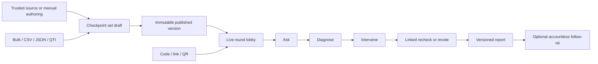

# OpenRound product and experience design

This document defines the implemented differentiated experience and the design constraints for
future work. It does not claim that external demand, legal, security, accessibility, or production
gates have passed.

## Product intent

OpenRound is a privacy-preserving comprehension recovery system for higher education and workplace
learning. Its promise is that a facilitator can see what did not land, take an appropriate action,
and check whether understanding recovered without requiring participant accounts.

The product loop is:

```text
Ask → Diagnose → Intervene → Recheck → Prove
```

Recovery evidence describes one session. It must never be presented as proof of long-term
learning, individual ability, or an automated judgment about a participant.

## Product principles

1. **Actionable before entertaining.** Competition is optional; diagnosis and recovery are always
   available.
2. **Guest-first participation.** A code, link, or QR is enough for live participation.
3. **Evidence with its limits visible.** Show measurements, thresholds, numerators,
   denominators, sample warnings, and evidence type.
4. **Facilitator agency.** Recommendations explain why they appeared and remain suggestions.
5. **Calm reliability.** A saved acknowledgement means durable acceptance; reconnect is an
   expected recoverable state.
6. **Private by default.** Do not build cross-session learner profiles from guest activity.
7. **Portable work.** Native JSON is lossless; standard and tabular formats report any loss.
8. **Accessible without disclosure.** Flexible time and accommodation passes require no stored
   reason and no public marker.

## Roles and permission model

| Role        | Experience priority                                                                |
| ----------- | ---------------------------------------------------------------------------------- |
| Owner       | Workspace accountability, membership, billing, deletion, content, hosting, reports |
| Editor      | Efficient authoring, hosting, co-facilitation, and evidence review                 |
| Viewer      | Safe read-only access to content and reports                                       |
| Cohost      | Focused live controls for one assigned round without account-wide authority        |
| Presenter   | Clean, read-only room display with no host credential reuse                        |
| Participant | Fast accountless entry, full content, private outcome, and trustworthy resume      |
| Operator    | Explicit configuration, migration, backup, privacy, and incident boundaries        |

## Experience architecture



The host, presenter, participant, report, and embed views are separate surfaces. They share the
same authoritative round but expose only the information and controls appropriate to their role.

## Authoring design

### Checkpoint model

Every checkpoint states its response type, purpose, confidence mode, delivery role, timer, score,
and optional concepts. Supported response types are single select, true/false, multiple select,
numeric, rating, and poll.

- Diagnostic and practice checkpoints may be scored and collect confidence.
- Opinion ratings and polls are always unscored with confidence off.
- Multiple select uses exact-set matching so partial guesses are not silently interpreted.
- Numeric values use normalized decimal strings and absolute tolerance, avoiding binary floating
  point scoring surprises.
- A main checkpoint can link to one differently worded recheck. Rechecks cannot chain or form
  cycles and default to zero points.

Private choice feedback and misconception keys support diagnosis after lock. They never appear in
an open participant payload.

### Source-grounded assistant

The assistant is an optional authoring accelerator, not a publishing agent or generic chat. It
accepts only pasted text or bounded private PDF/DOCX/PPTX files. It returns a main checkpoint,
linked recheck, rationales, misconception labels, and exact source citations. The UI requires
human review and an explicit action to create an unpublished draft, followed by the normal publish
step.

Assistant states are **disabled**, **waiting**, **creating draft**, **ready to review**, and
**needs attention**. Disabled means no source leaves the deployment. Generated citations remain
private creator metadata and the editor warns that a citation supports the original proposal if
the content is later edited.

## Live Recovery Loop

### Ask

Every participant device contains the complete prompt and controls. A shared projector is
optional. Server time owns the deadline and only a durable acknowledgement means an answer was
accepted.

### Diagnose

After lock, the host sees aggregate participation, correctness, confidence, response shape, and
authored misconception signals. Fewer than five responses suppresses a strong recommendation.
The default deterministic guidance is:

| Signal                                                      | Guidance                         |
| ----------------------------------------------------------- | -------------------------------- |
| Under 70% participation                                     | Check access or wait             |
| At least 20% confidently wrong                              | Give a targeted explanation      |
| Labelled distractor ≥25% of all or ≥50% of wrong, minimum 3 | Address that misconception       |
| Under 60% correct                                           | Explain or show a worked example |
| Correct and leading wrong answer within 15 points           | Invite peer discussion           |
| At least 80% correct and 30% of correct respondents unsure  | Brief reinforcement              |
| Otherwise                                                   | Continue or optionally recheck   |

Each card includes the observed value and rule. Language uses “suggested action,” never “the
system decided.”

### Intervene and recheck

Peer discussion may happen before reveal. Explanation, example, and break interventions happen
after reveal. The host records start/finish so the report can connect action to subsequent
evidence. A linked recheck is stronger evidence than repeating the same checkpoint; revote
improvement is displayed separately and never relabelled as linked recovery.

Leaderboards wait until the recovery branch is complete so competition does not interrupt the
learning action.

### Prove, carefully

Reports show initial evidence, confidence × correctness, misconception distribution,
interventions, linked-recheck recovery, revote improvement, unresolved concepts, participation,
response time, Q&A, and private participant feedback. Linked recovery is:

```text
initially incorrect participants who later answered the linked recheck correctly
───────────────────────────────────────────────────────────────────────────────
participants who answered both and were initially incorrect
```

Always show numerator, denominator, evidence type, and small-sample warning.

## Audience voice and moderation

Q&A lives beside the game engine so high-volume conversation does not inflate the canonical round
snapshot. It supports questions, votes, replies, cursor pagination, moderation, and realtime
updates.

- Education defaults: anonymous public display, private moderator alias, premoderation, replies
  off.
- Workplace defaults: alias display, postmoderation, replies on.
- Hosts and cohosts can publish, answer, dismiss, remove, kick, or ban.
- Text is sanitized and bounded; voting is unique per participant; rate limits are independent.

The moderator can change these settings before or during a round, but a hidden identity is never
retroactively exposed publicly.

## Follow-up and accommodations

A facilitator can turn unresolved concepts into an immutable self-paced follow-up. Live guests may
receive a one-attempt personal bearer link; a generic link remains anonymous and unpaired. Both
are expiring and revocable.

Time-flex mode removes the countdown. A 1.5× or 2× pass changes only server timing, stores no
reason, and is not visible to other participants. Resume and completion are server-owned. Follow-up
data inherits source-session retention and deletion.

## Presentation and portability

- Presenter popout and secure embed are read-only and use dedicated credentials.
- Normal pages deny framing. The embed route permits only the workspace's explicit HTTPS
  allowlist, up to ten origins.
- Direct links and downloadable QR assets remain stable for the round.
- OpenRound JSON preserves the full native model. CSV, bulk paste, and the constrained QTI 3
  profile produce visible validation reports and never silently discard unsupported content.

## Accessibility acceptance

WCAG 2.2 AA is the target for every release. Acceptance includes keyboard-only operation, visible
focus, semantic headings and controls, VoiceOver and NVDA walkthroughs, 200% zoom, text wrapping,
contrast, reduced motion, extended time, time-flex mode, and representative phone touch targets.
Correctness, status, danger, and selection must never rely on colour alone.

## Privacy and safety

- Open checkpoint payloads exclude correctness, explanations, misconception labels,
  distributions, and source citations.
- Participant identities remain session-scoped unless a contract-gated institution explicitly
  enables identified mode in a future release.
- Authoring prompts contain only the submitted source sections, never responses, reports, Q&A, or
  participant data.
- Creator, staff, presenter, guest, follow-up, and embed credentials have separate scopes.
- Export, deletion, retention, moderation, and sensitive administrative actions are explicit and
  audited.

## Error and recovery language

Errors identify the source, preserve safe work, and name the next action. For example, an editor
validation error points to the exact checkpoint and field; an authoring failure distinguishes
source extraction from provider generation; a late answer explains the server deadline; a lost
host credential points back to the original tab or credential issuance flow.

The UI must not claim success before the corresponding durable action completes.

## Deliberate non-goals

Native apps, a full slide editor, public content marketplace, avatars/rewards, generic AI chat,
open-text grading, advertising, participant profiling, and 1,000-player single events remain out
of scope. Native PowerPoint or Google Slides add-ins require evidence from at least three paying
design partners that companion mode is insufficient.

## Design change checklist

Before shipping a flow, verify:

1. The role, primary job, and permission boundary are explicit.
2. Loading, empty, success, validation, reconnect, permission, moderation, and terminal states
   exist.
3. Participant behavior works without a shared display, colour-only cues, or persistent identity.
4. Optimistic UI never contradicts server-owned state or durable acknowledgement.
5. Keyboard, screen reader, zoom, reduced motion, narrow viewport, and flexible-time behavior are
   covered.
6. Collection, prompt use, retention, export, deletion, and audit effects are documented.
7. Every recommendation and metric exposes its measurement and limitations.
8. Tests and telemetry distinguish validation, abuse, network recovery, provider failure, and
   service failure.

See the [user guide](user-guide.md), [architecture](architecture.md), and
[implementation status](implementation-status.md) for current behavior and remaining gates.
