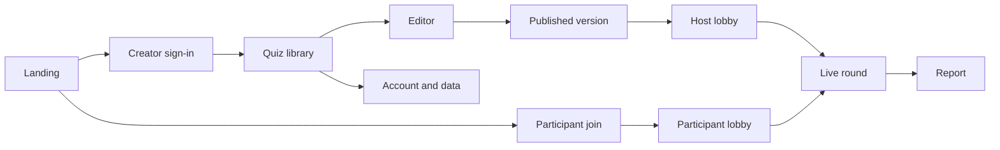

# OpenRound product and experience design

This document defines the P0 product experience implemented in the repository. It is a decision record and guide for future interface work, not a claim that every later roadmap feature exists.

## Product intent

OpenRound helps a facilitator answer one question during a live session: **what did this room understand, while there is still time to respond?**

The experience is intentionally calmer than an entertainment-first game. It keeps participation lightweight, preserves a clear facilitator pace, makes recovery visible, and turns the round into follow-up evidence.

### Goals

- Let a new creator publish a short quiz without training.
- Let participants join from a phone without an account.
- Show the complete question and answer labels on every participant device.
- Make accepted-answer durability and connection state understandable.
- Support education and workplace learning with one engine and different defaults.
- Produce an actionable report immediately after the round.
- Meet WCAG 2.2 AA as the release acceptance target.

### P0 non-goals

- Native mobile applications
- Participant accounts, persistent learner profiles, or public identity
- Assignments, self-paced play, cohorts, LMS, SSO, or roster synchronization
- Open-text answers, polls, surveys, AI authoring, or a public quiz marketplace
- Advertising, behavioral tracking, or child-directed profiling
- Single events above the supported 100-participant production ceiling

## Audiences and jobs

| Audience              | Primary job                                                        | Design implication                                                              |
| --------------------- | ------------------------------------------------------------------ | ------------------------------------------------------------------------------- |
| Educator              | Check understanding without publicly ranking learners              | Accuracy scoring, private results, friendly aliases, restrained motion          |
| Workplace facilitator | Reinforce learning and energize a group                            | Speed and accuracy are both meaningful; leaderboard is an available default     |
| Participant           | Join quickly, understand the prompt, and know the answer was saved | No account, one code, full labels, explicit acknowledgement and reconnect state |
| Operator/support      | Keep a live event recoverable and explain failures                 | Correlation IDs, health/metrics, deterministic errors, deletion and audit paths |

## Experience architecture

There are four distinct live surfaces:

- **Host controls** prioritize state, participant count, valid next actions, and recovery.
- **Presenter view** removes operational clutter and is readable from across a room.
- **Participant view** provides the full task, answer acknowledgement, and personal result.
- **Report view** shifts from facilitation to analysis and deletion/export decisions.

## Core journey

### 1. Prepare

The dashboard starts with a single title field. The editor separates question navigation from the selected question, autosaves after a short idle period, and exposes only two launch formats. Publishing is a deliberate action because it creates a frozen version.

Design rule: editing must feel forgiving, while publishing must feel consequential and understandable.

### 2. Gather

The host sees a large seven-digit code, a QR code, roster, and admission controls. Participants see confirmation that they are in and the name assigned to them. The round cannot start with an empty roster.

Design rule: the lobby answers “am I in the right room?” for both sides before introducing time pressure.

### 3. Ask and answer

Every device displays the prompt and full text labels. The host moves through guarded phases; participants can submit exactly once while a question is open. Countdown rendering is advisory; server time is authoritative.

Design rule: never encode an answer only by color, shape, position, or a shared-display reference.

### 4. Confirm and recover

After an accepted submission, the participant sees **Answer received and saved**. Connection indicators distinguish connected and reconnecting state. A reconnect requests a fresh role-filtered snapshot.

Design rule: acknowledge durable outcomes, not merely button presses. If the system cannot establish an outcome, say so and provide a recovery path.

### 5. Reveal and follow up

Reveal identifies the correct choice and can show an explanation. Standings appear only when the session allows them. The final report emphasizes difficult questions and learning follow-up rather than only rank.

Design rule: competition is optional; useful evidence is not.

## Session state model

| Phase           | Participant experience             | Host's primary action      | Presenter emphasis             |
| --------------- | ---------------------------------- | -------------------------- | ------------------------------ |
| Lobby           | Assigned nickname and joined count | Admit, remove, lock, start | Code and ready roster          |
| Question open   | Read and answer; countdown visible | Pause or lock              | Prompt, labels, timer          |
| Paused          | Inputs disabled; pause notice      | Resume or lock             | Stable question view           |
| Question locked | Inputs disabled; wait for reveal   | Reveal                     | Stable question view           |
| Question reveal | Personal result and explanation    | Standings or next          | Correct answer and explanation |
| Leaderboard     | Standings when enabled             | Next                       | Top standings                  |
| Finished        | Personal final score               | Open report                | Completion message             |

The interface derives available controls from the server phase. It must not optimistically invent a state transition that the server has not accepted.

## Content design

### Question constraints

- Prompt: 1–500 characters
- Quiz title: 1–160 characters; description: up to 1,000 characters
- Choice label: 1–180 characters
- Multiple choice: 2–6 choices with exactly one correct choice
- True/false: exactly 2 fixed choices with exactly one correct choice
- Timer: 5–300 seconds
- Explanation: up to 1,000 characters
- Optional image: JPEG, PNG, or WebP, up to 10 MB, with alt text up to 300 characters

### Voice and terminology

- Use **round** for a live event and **quiz** for authored content.
- Use **creator** or **facilitator** for the signed-in operator; use **participant** for a guest.
- Prefer direct state language: **Answer received and saved**, **Reconnecting…**, **Time expired**.
- Avoid blame, jokes in error messages, or language implying a participant's ability from one answer.
- Keep privacy language concrete: explain what is stored, for how long, and how to delete it.

## Visual and interaction principles

### Calm hierarchy

Each screen has one dominant task. Large headings and generous spacing establish context; panels group secondary controls. Live screens use a dark shell with high-contrast cards so question content remains the visual anchor.

### Redundant state cues

Correctness, selection, connection, and danger require text or iconographic cues in addition to color. Status text uses live regions where an update should be announced.

### Deliberate danger

Archive is visually distinct but reversible. Session deletion, account deletion, and ending a live session require explicit confirmation or typed confirmation proportional to impact.

### Responsive by role

- Participant controls must remain comfortably tappable on a narrow phone.
- Host controls should work on a laptop without requiring a projector.
- Presenter typography and code display should be legible at room distance.
- Reports may scroll tables horizontally rather than compress data into unreadable columns.

## Accessibility acceptance

Automated checks are necessary but not sufficient. Release acceptance includes:

- Complete keyboard operation with visible focus and logical order
- Correct headings, labels, landmarks, table headers, status, and alert semantics
- VoiceOver and NVDA walkthroughs for sign-in, authoring, hosting, joining, answering, and reporting
- 200% browser zoom without loss of content or actions
- Contrast checks for text, focus, choices, statuses, and errors
- Reduced-motion behavior and no required motion interpretation
- Extended-time testing and clear behavior when a server deadline expires
- Touch targets and text wrapping on representative phone widths

## Privacy and safety by design

- Participants remain session-scoped guests; no cross-session identity is created.
- Education defaults avoid public ranking and user-entered names.
- Open-question messages omit correct choices, explanations, and outcomes.
- Private media requires creator or session-scoped authorization.
- Export and deletion are first-class creator workflows.
- Administrative actions are authenticated and audited.
- Draft legal text is never presented as launch approval.

## Error and recovery design

Errors should identify what happened, preserve safe user work, and name the next action. Stable API error codes map to plain-language UI messages for invalid codes, full or locked sessions, rejected nicknames, stale host state, late or invalid answers, plan limits, authorization failures, and rate limits.

Reconnect is a normal state, not an exceptional dead end. The UI keeps the current safe view, indicates reconnecting status, and replaces it with an authoritative snapshot after recovery. It must never imply an answer was saved until the durable acknowledgement arrives.

## Design change checklist

Before shipping a new product flow, verify:

1. The role and primary job are explicit.
2. Loading, empty, success, validation, reconnect, permission, and terminal states are designed.
3. The behavior works without a shared display and without color-only meaning.
4. Server-authoritative state is not contradicted by optimistic UI.
5. Keyboard, screen reader, zoom, reduced motion, and narrow viewport behavior are covered.
6. Data collection, retention, export, deletion, and audit effects are documented.
7. Education and workplace defaults remain intentional rather than branching into separate products.
8. Tests and telemetry can distinguish user error, network recovery, and service failure.

See the [user guide](user-guide.md) for current UI behavior and [architecture](architecture.md) for the system guarantees behind it.
