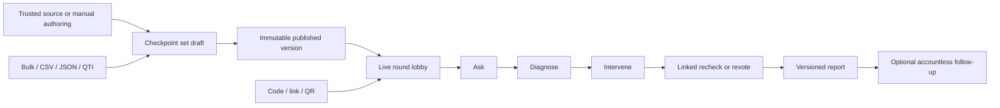

# OpenRound product and experience design

This document defines the implemented differentiated experience and the design constraints for
future work. It does not claim that external demand, legal, security, accessibility, or production
gates have passed.

## Product intent

OpenRound is a privacy-preserving comprehension recovery system for higher education and workplace
learning. Its promise is that a facilitator can see what did not land, take an appropriate action,
and check whether understanding recovered without requiring participant accounts.

The product loop is:

```text
Ask → Diagnose → Intervene → Recheck → Prove
```

Recovery evidence describes one session. It must never be presented as proof of long-term
learning, individual ability, or an automated judgment about a participant.

## Product principles

1. **Actionable before entertaining.** Competition is optional; diagnosis and recovery are always
   available.
2. **Guest-first participation.** A code, link, or QR is enough for live participation.
3. **Evidence with its limits visible.** Show measurements, thresholds, numerators,
   denominators, sample warnings, and evidence type.
4. **Facilitator agency.** Recommendations explain why they appeared and remain suggestions.
5. **Calm reliability.** A saved acknowledgement means durable acceptance; reconnect is an
   expected recoverable state.
6. **Private by default.** Do not build cross-session learner profiles from guest activity.
7. **Portable work.** Native JSON is lossless; standard and tabular formats report any loss.
8. **Accessible without disclosure.** Flexible time and accommodation passes require no stored
   reason and no public marker.

## Roles and permission model

| Role        | Experience priority                                                                |
| ----------- | ---------------------------------------------------------------------------------- |
| Owner       | Workspace accountability, membership, billing, deletion, content, hosting, reports |
| Editor      | Efficient authoring, hosting, co-facilitation, and evidence review                 |
| Viewer      | Safe read-only access to content and reports                                       |
| Cohost      | Focused live controls for one assigned round without account-wide authority        |
| Presenter   | Clean, read-only room display with no host credential reuse                        |
| Participant | Fast accountless entry, full content, private outcome, and trustworthy resume      |
| Operator    | Explicit configuration, migration, backup, privacy, and incident boundaries        |

## Experience architecture


```mermaid
flowchart LR
  Source[Trusted source or manual authoring] --> Set[Checkpoint set draft]
  Import[Bulk / CSV / JSON / QTI] --> Set
  Set --> Publish[Immutable published version]
  Publish --> Lobby[Live round lobby]
  Join[Code / link / QR] --> Lobby
  Lobby --> Ask[Ask]
  Ask --> Diagnose[Diagnose]
  Diagnose --> Intervene[Intervene]
  Intervene --> Recheck[Linked recheck or revote]
  Recheck --> Evidence[Versioned report]
  Evidence --> Followup[Optional accountless follow-up]
```

The host, presenter, participant, report, and embed views are separate surfaces. They share the
same authoritative round but expose only the information and controls appropriate to their role.

## Round Experiences

Round Experiences provide six accessible, versioned presets: Focus, Campus, Studio, Blueprint,
Signal, and Spark. A checkpoint-set category recommends one preset, but explicit creator choice
wins. The published version stores that choice. Session setup may override it once, and session
creation freezes the resolved semantic theme for reconnect and process restoration.

Presets own semantic colour tokens, six checked answer colours, bundled/system typography,
original CSS/SVG patterns, component treatment, motion profile, and optional original sound-cue
identity. Existing workspace branding layers organization name and constrained accent surfaces on
top. A participant’s local high-contrast, reduced-motion, and mute settings layer last. Clients
receive validated tokens and never arbitrary CSS, fonts, uploaded backgrounds, or uploaded sound.

Preset changes are intentionally non-behavioural. They cannot change scoring, timers, checkpoint
order, visibility, or control placement. Audio is opt-in, begins muted on each device, and always
duplicates a visual event.

## Authoring design

### Checkpoint model

Every checkpoint states its response type, purpose, confidence mode, delivery role, timer, score,
and optional concepts. Supported response types are single select, true/false, multiple select,
numeric, rating, and poll.

- Diagnostic and practice checkpoints may be scored and collect confidence.
- Opinion ratings and polls are always unscored with confidence off.
- Multiple select uses exact-set matching so partial guesses are not silently interpreted.
- Numeric values use normalized decimal strings and absolute tolerance, avoiding binary floating
  point scoring surprises.
- A main checkpoint can link to one differently worded recheck. Rechecks cannot chain or form
  cycles and default to zero points.

Private choice feedback and misconception keys support diagnosis after lock. They never appear in
an open participant payload.

### Source-grounded assistant

The assistant is an optional authoring accelerator, not a publishing agent or generic chat. It
accepts only pasted text or bounded private PDF/DOCX/PPTX files. It returns a main checkpoint,
linked recheck, rationales, misconception labels, and exact source citations. The UI requires
human review and an explicit action to create an unpublished draft, followed by the normal publish
step.

Assistant states are **disabled**, **waiting**, **creating draft**, **ready to review**, and
**needs attention**. Disabled means no source leaves the deployment. Generated citations remain
private creator metadata and the editor warns that a citation supports the original proposal if
the content is later edited.

### Question Health

Question Health is a separately gated, deterministic advisory review. It exposes the rule,
question/field, observed evidence, and suggested action for one saved draft revision. It covers
choice duplication/overlap and length cues, missing rationales/explanations/citations, mobile
density, conflicting settings, and linked-recheck wording or concepts. It does not block publish
or make an automatic judgment about content quality.

Owners and editors can dismiss a finding with a reason and reopen it. Dismissals are shared
workspace decisions scoped to matching relevant content and rules; editing that content
invalidates the match. Previously saved decisions remain reviewable and reopenable when new
reviews are paused. Supported fixes require a user-prepared field revision, preview, and explicit
apply through the normal saved-draft path. One-step undo is valid only while that applied revision
is still current. Other fields use normal manual editing; nothing publishes automatically.

Published-version analysis reads an immutable version separately from the current draft. A
matching-question link may open the draft, but edits affect future publication rather than
rewriting existing versions or sessions. Post-use observations read at most 250 recent retained
completed-session reports for that exact version. Trust, timed/flex, and speed/accuracy cohorts
remain separate. Each included question/session requires 20 responses; accuracy instability
requires three compatible sessions and a 30-percentage-point range. Unused-distractor advice
requires complete choice-count evidence. These bounded descriptive aggregates exclude opinion
questions and linked rechecks and do not create participant profiles or establish cause or durable
learning.

## Live Recovery Loop

### Ask

Every participant device contains the complete prompt and controls. A shared projector is
optional. Timed rooms use a server-owned deadline. Separately gated whole-room flex mode removes
question countdowns and deadlines, disables speed bonuses, and leaves response closure to the
host. The timing choice is frozen at session creation for Rounds and live Presentations;
pause/resume and reconnect preserve it without adding a per-participant marker or stored reason.
Only a durable acknowledgement means an answer was accepted.

### Diagnose

After lock, the host sees aggregate participation, correctness, confidence, response shape, and
authored misconception signals. Fewer than five responses suppresses a strong recommendation.
The default deterministic guidance is:

| Signal                                                      | Guidance                         |
| ----------------------------------------------------------- | -------------------------------- |
| Under 70% participation                                     | Check access or wait             |
| At least 20% confidently wrong                              | Give a targeted explanation      |
| Labelled distractor ≥25% of all or ≥50% of wrong, minimum 3 | Address that misconception       |
| Under 60% correct                                           | Explain or show a worked example |
| Correct and leading wrong answer within 15 points           | Invite peer discussion           |
| At least 80% correct and 30% of correct respondents unsure  | Brief reinforcement              |
| Otherwise                                                   | Continue or optionally recheck   |

Each card includes the observed value and rule. Language uses “suggested action,” never “the
system decided.”

### Intervene and recheck

Peer discussion may happen before reveal. Explanation, example, and break interventions happen
after reveal. The host records start/finish so the report can connect action to subsequent
evidence. A linked recheck is stronger evidence than repeating the same checkpoint; revote
improvement is displayed separately and never relabelled as linked recovery.

Leaderboards wait until the recovery branch is complete so competition does not interrupt the
learning action.

### Prove, carefully

Reports show initial evidence, confidence × correctness, misconception distribution,
interventions, linked-recheck recovery, revote improvement, unresolved concepts, participation,
response time, Q&A, and private participant feedback. Linked recovery is:

```text
initially incorrect participants who later answered the linked recheck correctly
───────────────────────────────────────────────────────────────────────────────
participants who answered both and were initially incorrect
```

Always show numerator, denominator, evidence type, and small-sample warning.

### Session decision replay

Decision replay is captured only for new Round sessions created under its workspace rollout gate.
That capture choice is frozen, so pausing new capture does not remove it from existing sessions.
Events are written with the durable transition: measured insight and recommendation/ruleset at
lock, reveal, intervention start/finish, linked recheck or revote opening, question advance, and
session finish. Idempotent retries do not add a second decision event.

Report v4 adds this ordered timeline and exports it as descriptive facilitation context. It does
not infer decisions from participant answers, record audio/video, change scoring, or establish
that an intervention caused a recovery outcome. Older sessions may have no replay; the 5,000-event
capture limit can produce a partial timeline. Availability and completeness must be shown
explicitly rather than reconstructing missing actions.

## Audience voice and moderation

Audience Pulse, chat, and Q&A live beside the game engine so high-volume interaction does not
inflate or corrupt the authoritative round snapshot.

Pulse offers **Got it**, **I’m unsure**, **Show an example**, and **Too fast**. Signals are
contextual and replaceable, not scores. Host/cohost views may connect a signal to the session alias
for facilitation; public/presenter views receive aggregates only after five unique signalers. The
open-checkpoint dashboard never reveals individual response content, correctness, confidence, or
score. Pulse is displayed separately from deterministic Recovery Loop recommendations until pilot
evidence justifies any rule change.

Room chat is a chronological, plain-text conversation with one-level replies and four reactions.
It is off by default and has independent slow mode, hard distributed limits, moderation, and
presenter feed controls. A message stores its identity mode at creation: private-alias content can
never become publicly attributed after a setting change. Removed content is omitted from normal
views and remains available only to an explicitly authorized audit view until retention expires.

Q&A remains the structured question workflow. It supports questions, votes, replies, cursor
pagination, moderation, and realtime updates.

- Education defaults: anonymous public display, private moderator alias, premoderation, replies
  off.
- Workplace defaults: alias display, postmoderation, replies on.
- Hosts and cohosts can publish, answer, dismiss, remove, kick, or ban.
- Text is sanitized and bounded; voting is unique per participant; rate limits are independent.

The moderator can change these settings before or during a round, but a hidden identity is never
retroactively exposed publicly.

## Practice assignments, recovery follow-up, and accommodations

A facilitator can turn unresolved concepts into an immutable self-paced recovery follow-up or
assign the main questions from a Round's current published version as standalone practice. The
source version is frozen so later edits do not change work already shared. Recovery may issue
one-attempt links to live guests; a standalone assignment may issue labelled, accountless,
one-attempt links. A generic link remains anonymous and unpaired. All bearer links expire;
personal and accommodation links can be revoked without exposing their stored hashes, and closing
the practice disables every link.

Time-flex mode removes the countdown. A 1.5× or 2× pass changes only server timing, stores no
reason, and is not visible to other participants. Resume and completion are server-owned. Recovery
data inherits source-session retention and deletion; standalone assignment data uses the plan's
retention window and is purged directly at its immutable expiry.

## Presentation and portability

### Structured Presentation slides

The gated Presentation builder combines content slides with interactive question blocks. Its v2
content model supports six structured layouts—Title, Title + body, Media, Quote, Section, and
Callout—and up to eight text elements total, exactly one of them a title. Titles are bounded to 160
characters and each body text element to 4,000. Legacy title/body documents are upcast on read;
this model change requires no database migration and does not mutate stored published snapshots.

Text uses bounded rectangles expressed as percentages of a 16:9 canvas. Drag handles and keyboard
controls move and resize them; arrow keys adjust by 1%, or 5% with Shift, and numeric inspector
fields provide the same control. Nine region shortcuts and per-region order provide structured
alternatives. Editor-only guides show a 10% grid, safe margins, and alignment cues. Applying a
layout resets placement, while undo restores the previous arrangement.
Custom text rectangles may overlap with an editor warning; an image's reserved area remains
protected.

The same content renderer serves the builder canvas, preview, facilitator, and participant views.
Narrow screens use a complete reading column; desktop overflow remains scrollable rather than
silently hiding text. An attached image reserves its preset area. Starter text reflows; custom
frames intersecting the image are adjusted and later moves/resizes remain clear of it. Removing
the image restores starter space while preserving custom arrangements. Speaker notes and source
citations remain outside participant content. Rotation, shapes, detailed typography, and an
unbounded freeform design canvas remain deferred.

### Presenter access and exports

- Presenter popout and secure embed are read-only and use dedicated credentials.
- Normal pages deny framing. The embed route permits only the workspace's explicit HTTPS
  allowlist, up to ten origins.
- Direct links and downloadable QR assets remain stable for the round.
- OpenRound JSON preserves the full native model. CSV, bulk paste, and the constrained QTI 3
  profile produce visible validation reports and never silently discard unsupported content.

## Accessibility acceptance

WCAG 2.2 AA is the target for every release. Acceptance includes keyboard-only operation, visible
focus, semantic headings and controls, VoiceOver and NVDA walkthroughs, 200% zoom, text wrapping,
contrast, reduced motion, extended time, time-flex mode, and representative phone touch targets.
Correctness, status, danger, and selection must never rely on colour alone.

## Privacy and safety

- Open checkpoint payloads exclude correctness, explanations, misconception labels,
  distributions, and source citations.
- Participant identities remain session-scoped unless a contract-gated institution explicitly
  enables identified mode in a future release.
- Authoring prompts contain only the submitted source sections, never responses, reports, Q&A, or
  participant data.
- Creator, staff, presenter, guest, follow-up, and embed credentials have separate scopes.
- Export, deletion, retention, moderation, and sensitive administrative actions are explicit and
  audited.

### Archive and permanent deletion

Archiving an artifact is reversible; permanent deletion requires an owner and explicit
confirmation. Only archived Rounds and Presentations are offered for permanent Library deletion.
Retained sessions and practice assignments block it so immutable source versions remain available
to work already issued. Deletion removes the artifact's drafts, published versions, authoring and
recovery history, and organization links; media references follow the normal storage cleanup
lifecycle.

Session history has a separate deletion action for finished or live-access-expired sessions in
the Sessions UI. Access expiry and history retention are distinct: an expired code cannot resume a
room even while its history remains available to its owner. Confirmed session deletion removes
responses, reports, and linked recovery follow-ups, releases live access, and leaves the source
artifact intact. Permanent Library deletion uses migration `048_library_artifact_deletion.sql`;
the structured-slide read upcast does not require a migration.

## Error and recovery language

Errors identify the source, preserve safe work, and name the next action. For example, an editor
validation error points to the exact checkpoint and field; an authoring failure distinguishes
source extraction from provider generation; a late answer explains the server deadline; a lost
host credential points back to the original tab or credential issuance flow.

The UI must not claim success before the corresponding durable action completes.

## Deliberate non-goals

Native apps, an unbounded freeform slide editor, public content marketplace, persistent learner avatar profiles or
reward economies, generic AI chat, open-text grading, advertising, participant profiling, and
1,000-player single events remain out of scope. Session-scoped avatar choice is intentionally
allowed because it carries no learner account or cross-session profile. Native PowerPoint or
Google Slides add-ins require evidence from at least three paying design partners that companion
mode is insufficient.

## Design change checklist

Before shipping a flow, verify:

1. The role, primary job, and permission boundary are explicit.
2. Loading, empty, success, validation, reconnect, permission, moderation, and terminal states
   exist.
3. Participant behavior works without a shared display, colour-only cues, or persistent identity.
4. Optimistic UI never contradicts server-owned state or durable acknowledgement.
5. Keyboard, screen reader, zoom, reduced motion, narrow viewport, and flexible-time behavior are
   covered.
6. Collection, prompt use, retention, export, deletion, and audit effects are documented.
7. Every recommendation and metric exposes its measurement and limitations.
8. Tests and telemetry distinguish validation, abuse, network recovery, provider failure, and
   service failure.

See the [user guide](user-guide.md), [architecture](architecture.md), and
[implementation status](implementation-status.md) for current behavior and remaining gates.
