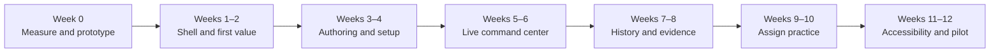

# OpenRound 2026 Kahoot-alternatives benchmark and UX implementation plan

Research date: 2026-09-18

This document benchmarks the products named in StudyGlen's “10 Best Free Kahoot Alternatives in
2026” guide against current first-party product material and the OpenRound implementation. It
combines a repository audit, a local end-to-end product walkthrough, current vendor documentation,
and product-strategy judgment.

Prices, plan limits, and vendor features change frequently. Recheck them before changing pricing,
publishing a comparison page, or making a sales claim. “Missing” below means no implemented or
discoverable OpenRound workflow was found; it is not a claim that a competitor owns a feature.

## Executive decision

OpenRound should **not** copy Kahoot, Blooket, Gimkit, or StudyGlen screen-for-screen, and it should
not enter a game-mode arms race. It should match the category on **speed, clarity, reuse, and
delivery choice**, then make its existing Recovery Loop unmistakable:

> **Match incumbents on getting from material to a room. Win on what happens after the room gets an
> answer wrong.**

The fastest credible strategy is:

1. **Expose what already exists.** OpenRound already has six response types, source-grounded
   authoring, guest joining, presenter/cohost roles, Pulse, chat, Q&A, deterministic insights,
   interventions, linked rechecks, reports, and accountless follow-ups. The current information
   architecture makes this depth difficult to discover.
2. **Make first value take minutes.** Replace separate blank-create, import, and AI areas with one
   Create Round launcher: starter, source, import, or blank.
3. **Give every reusable Round three obvious actions.** `Host live`, `Assign practice`, and `Edit`.
   Organization, duplication, exports, and archiving belong in `More`.
4. **Turn the live host page into a command center.** Keep the current stage, put the Recovery Loop
   and one state-aware next action in a fixed rail/bar, and move Pulse, participants, Q&A, and chat
   into one Audience drawer.
5. **Make evidence retrievable and visual.** Add Sessions and Results indexes, a one-screen recovery
   story, safe post-lock distributions, and a one-click follow-up.
6. **Close the offering gap deliberately.** Validate moving Hosted Free from 20 to 50 participants
   and Hosted Pro from 100 toward 250 only after hosted cost, abuse, failover, and support evidence.
7. **Protect the wedge.** Do not delay this work for a public marketplace, full slide editor,
   avatars, an arcade economy, twenty modes, native apps, or 1,000-person single events.

## Research caveat: use the StudyGlen guide as an index, not ground truth

The linked article discloses that StudyGlen publishes it, ranks StudyGlen first, evaluates every
competitor relative to StudyGlen, and ends in StudyGlen conversion calls to action. That makes it a
useful product list, not an independent test.

Material issues found during verification:

- The article says StudyGlen uniquely creates questions from a user's source material. Wayground,
  AhaSlides, Socrative, and Kahoot also publish source/file-assisted creation workflows.
- It says Wayground's AI does not work from uploaded documents, while current Wayground material
  explicitly lists links, PDFs, worksheets, and prompts.
- It says Blooket lacks AI creation and implies most modes are paid. Blooket documents a free
  Khanmigo integration and a catalog of more than 25 modes, only some of which are Plus-only.
- It pairs Gimkit's 500-player headline with its 2D experiences, but Gimkit documents a 60-player
  limit for all 2D modes.
- It understates AhaSlides: current Free includes five PDF/PPT-to-quiz queries per month, while
  education pricing starts below the article's quoted entry price.
- It says Wordwall publishes only local-currency pricing, while the current official page exposes
  USD pricing in the reviewed region.
- It contradicts itself on StudyGlen self-paced assignments: one section says they are free while
  the comparison table says there is no self-paced mode.
- StudyGlen's own current pages conflict on live capacity: its interactive-quiz FAQ says 50 while
  its teacher page says 100. The conservative benchmark below uses 50 and marks the conflict.
- The article's September 8 Kahoot AI statement was already stale by September 17, when Kahoot
  documented a ChatGPT integration for creating and saving a limited number of questions.

Decision: preserve the shortlist, but base product and pricing choices on first-party sources,
observed workflows, and OpenRound customer research.

## Current market benchmark

The table emphasizes the buying or usage advantage that matters, not every feature in every plan.

| Product        | Current free entry                                                                                                                           | Experience advantage                                                                                                                                       | OpenRound implication                                                                                                        |
| -------------- | -------------------------------------------------------------------------------------------------------------------------------------------- | ---------------------------------------------------------------------------------------------------------------------------------------------------------- | ---------------------------------------------------------------------------------------------------------------------------- |
| **Kahoot**     | Usually 10–40 participants depending on account category; free/basic capabilities vary                                                       | Category-leading polish, ready-made content, familiar live/assignment workflow, broad paid question types                                                  | Match the clarity of `Host` and `Assign`, not its branding, shapes, sounds, or game-show identity                            |
| **StudyGlen**  | One AI quiz/flashcard generation daily; unlimited live sessions; its live FAQ says 50 participants, while another official page says 100     | Extremely short PDF/image/text/YouTube/Anki-to-live-game path, explanations, generated diagrams, 41 languages                                              | Put source creation in the primary Create flow and measure source-to-room time                                               |
| **Wayground**  | Up to 100 participants, limited storage, live and asynchronous delivery, accommodations, and AI                                              | Broad instructional formats, differentiation, anti-cheating, assignments, and institutional integrations                                                   | Make delivery choice and accessibility visible; do not attempt its full suite immediately                                    |
| **Blooket**    | Unlimited sets, 60 players, 14-day homework, public library, and many modes                                                                  | Strong student pull, content reuse, collectibles, and 25+ documented modes                                                                                 | Add starter content and one restrained team mode; do not build an arcade economy                                             |
| **Gimkit**     | Rotating free modes; standard games up to 500, all 2D modes up to 60; assignments require Pro                                                | Deep cooperative/competitive 2D play with configurable game/learning balance                                                                               | Separate content from delivery mode; defer world-building and cosmetics                                                      |
| **Slido**      | 100 participants, three polls and one quiz per Slido, audience Q&A                                                                           | Best-in-class anonymous/upvoted Q&A, moderation, cohosting, and presentation integrations                                                                  | Consolidate OpenRound audience tools and add a persistent host control bar                                                   |
| **AhaSlides**  | 50 participants, five quiz plus three unscored slides, five PDF/PPT AI queries monthly                                                       | Presentation-first creation, broad interaction types, self-paced delivery, and visible import                                                              | Use a slide companion later; do not build a full presentation editor now                                                     |
| **Mentimeter** | 50 cumulative participants per month plus one session that may exceed the threshold                                                          | Highly polished result visuals, 23 slide types, AI, and an excellent presenter workflow                                                                    | Improve result visualization and hierarchy; breadth is not the near-term moat                                                |
| **Socrative**  | 50 students, five quizzes, one room, 30-day history, and bounded AI generation/import/analysis                                               | Strong assessment, exit-ticket, room, and question/participant reporting workflows                                                                         | Preserve OpenRound's stronger recovery story while adding history and drill-down clarity                                     |
| **Baamboozle** | Free core play; current official material does not publish a simple participant ceiling                                                      | One shared screen can run teacher-led team play without participant devices                                                                                | Consider a later facilitated team mode only if target customers ask for it                                                   |
| **Wordwall**   | Three created activities and 12 templates                                                                                                    | One content set switches among 34 interactive templates; assignments, printables, and a large library                                                      | Build content reuse and a few delivery modes before adding more visual themes                                                |
| **OpenRound**  | Hosted Free: 20 participants, five published sets, 30-day aggregate reports, three AI jobs when configured; Community is operator-configured | Accountless Recovery Loop, confidence, misconceptions, interventions, linked rechecks, privacy, accessibility, durability, Q&A/Pulse/chat, and portability | The technical wedge exists; activation, discoverability, assignment breadth, visual insight, and packaging are the real gaps |

### Market baseline that users now expect

A credible 2026 live-learning product combines eight systems:

1. Code, link, and QR joining without a participant account.
2. Separate host, participant, and room/presenter surfaces.
3. Live plus self-paced delivery, with team/cooperative delivery where the segment values it.
4. Fast creation from a topic, source document, slides, URL/video, spreadsheet, or reusable content.
5. Several meaningful response types rather than only four-choice trivia.
6. Reusable content that is not trapped in one visual/game mode.
7. Live insight, question-level reports, export, and a retrievable history.
8. An engagement layer appropriate to the audience.

OpenRound is already strong on 1, 2, much of 5, and the depth of 7. It is partial on 3, 4, and 6,
and intentionally restrained on 8.

## Verified OpenRound baseline

This plan is based on implemented code, not only roadmap claims. On the audited branch:

- 166 tests passed; five infrastructure-gated tests were skipped by the normal test command.
- All seven workspace packages passed strict type checking and production builds.
- The web app exposes home, account, dashboard, authoring, preview, host setup, host, presenter,
  participant, report, follow-up, join, pricing, institution, status, privacy, and terms surfaces.
- The API exposes authoring, import/export, immutable publish, session/realtime, staff, audience
  interaction, reports, follow-up, media, billing, retention, account, audit, OIDC, and LTI paths.
- PostgreSQL, Redis coordination/replay, durable answer acknowledgement, command idempotency,
  reconnect snapshots, role filtering, and report reconciliation are already implemented.

The older competitive roadmap remains strategically useful, but its statement that OpenRound has
only two response types and lacks confidence, remediation, follow-up, and portability is now stale.
Those capabilities are present in the current implementation.

### Strong today

- Six response types: single select, true/false, multiple select, numeric, rating, and poll.
- Confidence, concept metadata, private misconception labels and feedback, linked rechecks, and
  deterministic facilitator guidance.
- Accountless seven-digit code, direct-link, and QR joining, with participant resume credentials.
- Separate host, cohost, presenter, embed, and participant credentials and views.
- Accuracy/private-result and speed/leaderboard choices.
- Six accessible Round Experience presets plus local contrast, motion, and mute preferences.
- Pulse, moderated Q&A, room chat, replies, reactions, pinning, reporting, mute, ban, and kick.
- Accountless self-paced follow-ups with personal/generic links and time-flex accommodations.
- JSON, CSV, bulk, and QTI import; JSON/CSV/QTI export; folders, tags, search, duplicate, archive.
- Source-grounded pasted text/PDF/DOCX/PPTX proposals with citations and mandatory human review.
- Recovery-oriented reports, privacy-aware retention/deletion, open-source community operation,
  and unusually strong live-session correctness and security foundations.

### What the live UX walkthrough showed

The public home, join card, participant entry, lobby, question, host question stage, and Recovery
guidance are visually coherent and already more polished than the phrase “MVP” suggests. The
largest problems are hierarchy and orchestration:

- The dashboard puts blank creation and a large import form before the library. AI creation and
  folders are separate collapsed panels, so there is no single mental model for “create.”
- A library card can expose Edit, Host, Duplicate, Organize, Archive, and three export actions with
  similar visual weight.
- A new editor presents title, description, category, and experience before the first question.
  Each choice permanently exposes private misconception and feedback fields. Advanced diagnostic
  metadata reads like schema configuration rather than instructional guidance.
- Host setup is clear but long; it lacks a one-click “use my defaults” path or named setup recipes.
- The live question stage is strong. Below it, staff, seven Pulse/chat metrics, participant
  moderation, chat, and Q&A form a long operational page. The next action can move below the fold.
- The participant task is clear, but Pulse, chat, and Q&A live beneath it as a long page rather
  than an optional interaction tray.
- Single-select can submit on the first tap while other response types require an explicit submit,
  increasing the risk of accidental answers and inconsistent expectations.
- The report is comprehensive but starts with overlapping metric rows and then many panels/tables.
  It does not yet tell the recovery story with a quick visual narrative.
- There is no creator-facing Sessions, Results, or Follow-ups index. If a report URL is lost, the
  product has no normal history workflow for finding it again.

## Real product gaps and priorities

Legend: **Strong** = differentiated or at least credible; **Partial** = implemented but narrow or
hard to discover; **Gap** = no complete user-facing workflow found.

| Capability                            | Status             | Why it matters                                                                | Decision                                                                                  | Priority           |
| ------------------------------------- | ------------------ | ----------------------------------------------------------------------------- | ----------------------------------------------------------------------------------------- | ------------------ |
| Guest join, QR/link, reconnect        | Strong             | Basic trust and participation                                                 | Preserve; remove redundant nickname step for generated-alias rooms and add safe preflight | P0 polish          |
| Host/participant/presenter separation | Strong             | Live-room reliability and safety                                              | Preserve; redesign composition, not protocol                                              | P0 polish          |
| Recovery Loop and explained insights  | Strong and unique  | Ownable outcome beyond engagement                                             | Make the rail visible across create, host, and report                                     | P0 differentiation |
| First-run creation                    | Partial            | Competitors make the first successful session feel instant                    | One Create Round launcher and curated starter rounds                                      | P0                 |
| Authoring speed and clarity           | Partial            | Current power is obscured by technical fields and a very long editor          | Basic/advanced disclosure, paired recheck editor, in-context preview, plain language      | P0                 |
| Session/report history                | Gap                | Evidence cannot become a repeat workflow if it is not retrievable             | Paginated Sessions, Results, and Follow-ups indexes                                       | P0                 |
| Live operational focus                | Partial            | Facilitators have seconds, not minutes, to choose the next action             | Sticky command bar, Recovery rail, Audience drawer                                        | P0                 |
| Visual live/report insight            | Partial            | Tables and prose slow comprehension                                           | Safe post-lock distributions, recovery comparison, intervention timeline                  | P0                 |
| Product adoption analytics            | Gap                | The team cannot choose gaps by actual funnel evidence                         | Privacy-preserving event schema and baseline dashboards                                   | P0                 |
| General self-paced assignment         | Partial            | Existing follow-up begins only from a completed report                        | `Assign practice` from any published Round, with deadline/progress/resume                 | P1                 |
| Templates and question reuse          | Gap                | Libraries and reuse reduce preparation cost more than cosmetic modes          | Curated first-party starters and private workspace question reuse                         | P1                 |
| Free plan competitiveness             | Weak               | 20 is visibly below common 50–100-person free offers                          | Validate a 50-person Hosted Free ceiling                                                  | P1 commercial gate |
| Team/cooperative delivery             | Gap                | Blooket/Gimkit engagement is hard to match with one delivery pattern          | Add one accessible `Team discuss` mode after core UX                                      | P1/P2              |
| Live accessibility accommodations     | Partial            | Local display preferences are strong; live extra-time support is not complete | Add accountless live time-flex/extra-time behavior after usability testing                | P1                 |
| Short text, rank/order, word cloud    | Gap                | Common in presentations and assessment                                        | Add exact-match short text and rank/order first; moderate open text before word cloud     | P2                 |
| Slide companion/integration           | Gap                | Higher education/workplace facilitators already have decks                    | Companion window/remote first; native add-ins only after demand                           | P2                 |
| LMS roster/grade passback             | Partial foundation | Required for institutional buying, expensive and identity-sensitive           | Complete NRPS/AGS only behind contract, privacy, and pilot gates                          | P2 institution     |
| Public marketplace                    | Gap by design      | High moderation/IP/discovery cost and incumbent scale advantage               | Defer; use first-party starters and workspace sharing                                     | Defer              |
| Arcade economy/20 game modes          | Gap by design      | High effort, weak fit with target ICP, risks obscuring learning               | Do not pursue; keep optional delight lightweight                                          | Defer              |

## Target product architecture

### Information architecture

Use plain user jobs in the persistent application shell:

```text
Home
├── Rounds       reusable content
├── Sessions     live, scheduled, active, and completed runs
├── Results      recovery evidence and exports
├── Templates    curated first-party starters
└── Workspace    people, plan, brand, integrations, privacy
```

Terminology to test with customers:

| Current term   | Candidate UI term      | Reason                                                                       |
| -------------- | ---------------------- | ---------------------------------------------------------------------------- |
| Checkpoint set | Round                  | Short, brand-consistent, less technical                                      |
| Checkpoint     | Question or checkpoint | Use “question” for basic creation and “checkpoint” when explaining diagnosis |
| Live session   | Session                | Already familiar and accurate                                                |
| Follow-up      | Practice follow-up     | Makes the asynchronous job explicit                                          |

Do not rename persisted contracts merely to change interface copy. Test vocabulary first, then use
presentation-layer labels while keeping stable API concepts.

### Reusable Round actions

Every published Round detail and library card should lead with:

1. **Host live**
2. **Assign practice**
3. **Edit**

Move Preview, Duplicate, Organize, Export, and Archive into a `More` menu. Show status, question
count, last edited, and last hosted; do not turn the card into an action toolbar.

### Unified Create Round launcher

Offer four mutually clear starts in one dialog/page:

- **Use a starter** — curated, first-party Recovery Loop examples.
- **Create from a source** — paste or upload, show supported inputs and provider/privacy state.
- **Import existing work** — CSV, QTI, OpenRound JSON, and bulk paste.
- **Start blank** — choose the first response type immediately; ask for title later or generate one.

Source creation should show a small staged flow: `source → review proposal → edit → publish`. It
must keep citations beside the generated checkpoint and never imply automatic correctness.

### Authoring

- Keep question navigation and a participant preview visible while editing.
- Replace six equal-weight add buttons with one Insert control containing response types and plain
  examples of when to use each.
- Pair the main checkpoint and linked recheck visually. Replace the raw linked-ID selector with
  `Add a recheck for this concept`.
- Rename `misconception key` to `Why might someone choose this?`; generate a stable private key
  behind the label if reporting needs one.
- Keep prompt, answers, correct answer, media, timer, and explanation in the basic view. Put
  purpose, concepts, confidence rules, detailed feedback, and source evidence in purposeful
  disclosure groups rather than one generic “Advanced” dump.
- Add undo for destructive editor actions and drag/reorder that retains keyboard alternatives.

### Session setup recipes

Keep visual Experience, delivery mode, scoring, result visibility, and pace as separate concepts.
Offer opinionated recipes that map to current settings:

| Recipe               | Default behavior                                                                 |
| -------------------- | -------------------------------------------------------------------------------- |
| Recovery             | Accuracy scoring, private results, confidence/recheck emphasis, calm experience  |
| Friendly competition | Speed scoring, leaderboard available after recovery branch, energetic experience |
| Open discussion      | Unscored poll/rating emphasis, Q&A/Pulse visible, flexible timing                |

Show `Start with these settings` first. Put audience limit, late join, aliases, detailed interaction
moderation, sound, and overrides under `Review settings`.

### Host command center

- **Center stage:** exactly what participants/presenter see now.
- **Recovery rail:** current step, live insight after lock, sample size/threshold, and suggested
  action.
- **Sticky command bar:** one primary action that changes with phase; Pause/extend, copy join link,
  and End remain reachable without scrolling.
- **Audience drawer:** tabs for Participants, Pulse, Q&A, and Chat; badges show actionable changes.
- **Persistent status:** connection, joined, answered, room code, checkpoint progress, and deadline.
- **Safe visual results:** distributions appear only after lock and only on roles allowed to see
  them. Preserve existing answer-key and individual-response boundaries.

### Participant experience

- Keep prompt/media, response, confidence, and saved acknowledgement in one focused viewport.
- Use consistent submit semantics. Recommended starting experiment: select, then confirm for every
  scored response; if immediate submit is retained, provide a short, server-safe change window.
- Move Pulse, Q&A, and chat to an optional bottom tray; essential answer and feedback states must
  never depend on opening it.
- Show a compact state progression: waiting, answering, saved, discussing, reviewing, rechecking,
  complete.
- Keep text/icon/shape cues alongside colour and preserve contrast, motion, mute, and keyboard
  behavior.

### Results and follow-up

The first viewport should answer four questions:

1. What recovered?
2. What remains unresolved?
3. What intervention happened?
4. What should I do next?

Then offer `Create practice follow-up`. Put question, participant, confidence, misconception,
conversation, and export detail behind clear drill-down tabs. Visuals should include:

- initial versus recheck accuracy with numerator/denominator and evidence type;
- post-lock response distribution;
- confidence × correctness matrix;
- intervention and recheck timeline;
- unresolved concepts ranked by evidence strength, with small-sample warnings.

Do not present session recovery as proof of long-term retention or facilitator quality.

## Implementation plan

The plan assumes one full-time engineer plus fractional product/design and accessibility support.
Two engineers can overlap the shell/editor and live/report tracks and expose the visible catch-up
slice in about six weeks. One engineer should budget 10–12 weeks for the complete P0/P1 sequence.



### Week 0 — baseline, contracts, and prototype

Scope:

- Define a privacy-preserving product-event schema for create, import/source proposal, publish,
  host setup, join, first answer, save acknowledgement, lock, insight, intervention, recheck,
  report view, and follow-up share.
- Exclude answer bodies, participant aliases, chat/Q&A text, source content, and sensitive report
  detail from adoption telemetry.
- Baseline the current funnel and task times before changing navigation.
- Test the host command center, report summary, and `Round` terminology with six target
  facilitators across higher education and workplace learning.
- Resolve the current pricing/entitlement mismatch for cohosting before making plan claims.

Likely code areas:

- `apps/web/app/dashboard/page.tsx`
- `apps/web/app/host/[sessionId]/page.tsx`
- `apps/web/app/report/[id]/page.tsx`
- `apps/server/src/metrics.ts` or a separate product-event service with stricter data rules
- `apps/server/src/entitlements.ts` and staff credential routes

Exit gate:

- Baseline dashboard exists; event payload review proves no prohibited content; six moderated tests
  establish the highest-friction steps and verify the new hierarchy before implementation.

### Weeks 1–2 — application shell and first value

Scope:

- Add persistent Rounds, Sessions, Results, Templates, and Workspace navigation.
- Make the current dashboard the Rounds hub or redirect it without breaking saved URLs.
- Add the unified Create Round launcher.
- Ship 6–10 first-party starter Rounds covering an exit ticket, misconception check, compliance
  check, technical concept, icebreaker poll, and workplace knowledge check.
- Simplify library cards to Host live, Assign practice (initially “coming next” or feature-flagged),
  Edit, and More.
- Add recent work, last edited/hosted, useful empty states, list/grid choice, and stable sorting.

Backend/data work:

- Add versioned starter metadata or immutable seed content. Do not create a public UGC model.
- Add any missing last-hosted summary through an aggregate query rather than loading session trees.

Exit gate:

- At least 80% of first-time usability participants start a starter or source-based room uncoached
  within five minutes; no regression to keyboard, zoom, or mobile navigation.

### Weeks 3–4 — authoring and fast setup

Scope:

- Split the 1,281-line editor into question navigation, core editor, diagnostic details, media,
  scoring/timing, and preview components.
- Add a grouped Insert menu and participant preview alongside the selected checkpoint.
- Present main checkpoint and recheck as a pair.
- Move choice rationale/feedback into per-choice disclosure and use instructional language.
- Add accessible reorder and undo.
- Add Recovery, Friendly competition, and Open discussion setup recipes, with advanced settings
  collapsed and an immediate `Create room` action.

Compatibility rule:

- Keep current contracts, immutable versioning, and saved setup fields. Recipes resolve to existing
  fields and do not silently change a published Round.

Exit gate:

- Median blank-to-publish time is below five minutes for a four-question Round; source-to-publish
  is below three minutes excluding provider generation time; old drafts round-trip unchanged.

### Weeks 5–6 — live command center and focused participant view

Scope:

- Recompose the host UI into stage, Recovery rail, sticky command bar, and Audience drawer.
- Keep the valid next action on-screen at 1280×720 and 390×844 without hiding destructive controls
  behind ambiguous icons.
- Add safe post-lock choice/distribution bars and compact response progress.
- Move participant Pulse/Q&A/chat into an optional bottom tray.
- Standardize scored-response submit behavior and strengthen saved/reconnect states.
- Add a compact presenter result state that does not expose private participant data.

Backend/protocol work:

- Reuse current phase-aware commands and audience services.
- Add only role-filtered, aggregate post-lock distribution fields that are missing; never emit
  answer correctness, misconception metadata, or distributions while a diagnostic is open.

Exit gate:

- Facilitators identify the valid next action within ten seconds in at least 90% of observed
  trials; 95% of participants complete the first answer without help; no open-question data leak.

### Weeks 7–8 — Sessions, Results, and visual evidence

Scope:

- Add creator-scoped, paginated APIs for sessions, reports, and follow-ups with status/date/Round
  filters and tenant enforcement.
- Add Sessions, Results, and Follow-ups views with recoverable links to active and past work.
- Redesign the report header around recovered, unresolved, intervention, and next action.
- Add distribution, recovery comparison, and intervention timeline visualizations.
- Put detailed tables, transcript, and exports behind drill-down tabs without removing them.

Likely backend areas:

- `packages/db/src/types.ts`, memory/PostgreSQL repositories, and a new migration only if existing
  indexes cannot support creator/workspace list queries.
- `apps/server/src/routes.ts` and `apps/server/src/reporting.ts`.
- `apps/web/app/report/[id]/page.tsx` plus new list routes.

Exit gate:

- A facilitator can find any retained report without a saved URL and identify the main unresolved
  concept in under 45 seconds; paginated queries stay tenant-scoped and use indexed plans.

### Weeks 9–10 — general Assign practice

Scope:

- Allow any published Round to create a standalone practice assignment, not only a remediation
  follow-up from a completed report.
- Support generic link, optional personal links, deadline/time-flex, one-attempt default, close,
  revoke, resume, and progress.
- Reuse current follow-up credentials, retention, accommodations, and answer engine where their
  semantics match; use a distinct purpose/evidence label where they do not.
- Add an assignment dashboard and `Assign practice` beside `Host live`.

Guardrail:

- Do not introduce persistent learner accounts or gradebook claims in this phase.

Exit gate:

- Median publish-to-shared-practice time is under 60 seconds; close/revoke/expiry/deletion cascade
  correctly; generic attempts remain unpaired and personal links remain revocable.

### Weeks 11–12 — accessibility, device, packaging, and pilot hardening

Scope:

- Complete VoiceOver and NVDA walkthroughs, keyboard-only use, 200%/400% zoom, contrast, reduced
  motion, phone/tablet/projector checks, slow/reconnecting networks, and no-shared-display use.
- Test live time-flex and extra-time behavior without storing a reason or publicly marking a
  participant.
- Run uncoached end-to-end pilots across both target segments.
- Measure hosted cost and support load at 20 and 50 free participants; raise the public limit only
  if the evidence passes.
- Validate Pro at 100 and then 250 participants through target-region rolling-process-loss and
  managed Redis failover before publishing a higher ceiling.

Exit gate:

- Zero critical or serious accessibility defects; physical-device matrix complete; all recovery
  and deletion invariants pass; packaging changes have signed cost, capacity, abuse, and support
  evidence.

## P2 backlog after the catch-up release

Order these by design-partner evidence, not competitor count:

1. Private workspace question bank and import-from-another-Round.
2. One accessible `Team discuss` mode with facilitator-controlled team assignment.
3. Exact-match short text and rank/order response types.
4. Slide companion/remote and presentation-window workflow.
5. Cross-session concept trends with honest cohort/sample boundaries.
6. Moderated word cloud/open response.
7. Collaborative authoring.
8. LTI NRPS/AGS, identified learner mode, and grade passback behind institutional contracts.

## Packaging hypothesis

Do not compete only on player count, but remove obvious acquisition friction:

| Edition     | Validated target                                     | Value boundary                                                                             |
| ----------- | ---------------------------------------------------- | ------------------------------------------------------------------------------------------ |
| Community   | Operator-configured                                  | Apache-2.0 product including the Recovery engine; operator owns infrastructure/support     |
| Hosted Free | Move from 20 toward 50 after evidence                | Core Recovery Loop, five published Rounds, 30-day result history, bounded source authoring |
| Hosted Pro  | Current 100; target 250 only after hosted validation | Unlimited Rounds, cohosting, exports, branding, assignments/follow-ups, 365-day evidence   |
| Institution | Contract/pilot based                                 | SSO/LTI, policy, region, audit, optional identified workflows, grade services, support/SLA |

Validate willingness to pay for **faster remediation and defensible evidence**, not merely a larger
room. The current $15 monthly Pro price is explicitly a launch hypothesis, not a verified market
price.

## Outcome measures

Baseline these first; the values below are provisional exit targets.

### Activation and creation

- At least 80% of first-time facilitators start a starter/source-based room uncoached within five
  minutes.
- Median source-to-review-draft time excludes provider latency but has a product-interaction budget
  below two minutes.
- Create-to-publish abandonment improves by at least 25% relative to baseline.

### Join and participant reliability

- Valid join completion at least 98%.
- Median QR-to-lobby below 15 seconds; p95 below 30 seconds on the supported network profile.
- At least 95% complete the first response without facilitator help.
- Durable answer receipt visible within one second at p95 at the supported ceiling.

### Facilitation and recovery

- Valid next action identified within ten seconds after lock in 90% of usability trials.
- Lock-to-insight remains below one second at p95.
- Track the share of eligible sessions that progress through insight → intervention → valid
  recheck → report review.
- Continue reporting recovery with numerator, denominator, evidence type, and sample warning; do
  not optimize the rate without context.

### Evidence and repeat use

- Main unresolved concept identified from the report in under 45 seconds median.
- Report-to-shared-follow-up below 60 seconds median.
- Four-week facilitator repeat use improves by at least 20% relative to measured baseline.

### Quality and trust

- Zero critical/serious accessibility defects in critical flows.
- No answer-key or aggregate-distribution exposure before lock.
- No tenant, credential, retention, export, or deletion regression.
- Product telemetry contains no participant answer, alias, chat/Q&A text, or source content.

## Engineering and rollout guardrails

- **Clean-room UI.** Reuse generic interaction patterns such as Host/Assign actions, QR joining,
  progressive disclosure, tabs, and a persistent control bar. Do not copy competitor artwork,
  layout measurements, wording, sounds, answer shapes, scoring formulas, or proprietary mechanics.
- **Front-end-led, not a rewrite.** Keep the authoritative engine, immutable versions, command
  fencing, durable acknowledgements, reconnect snapshots, and report reconciliation.
- **Role filtering first.** New live visualizations must be projected from server-approved
  aggregates and tested for every role and phase.
- **Feature-flag structural changes.** Roll out the new shell, editor, host composition, and
  assignment entry independently, with saved-URL and old-draft compatibility.
- **Split monoliths before adding breadth.** Extract stable components from the dashboard, editor,
  host, participant, and report pages; add focused component tests around state and accessibility.
- **Measure before monetizing.** Do not raise caps or advertise scale from local load tests alone.
- **Keep AI out of live decisions.** Source-grounded drafting remains human-reviewed; live insight
  stays deterministic and explainable.

## Immediate product backlog

| Rank | Epic                            | Primary outcome                       | Main dependency                                          |
| ---: | ------------------------------- | ------------------------------------- | -------------------------------------------------------- |
|    1 | Product funnel baseline         | Know where adoption actually fails    | Privacy review and event contract                        |
|    2 | Sessions/Results history        | Make the evidence promise retrievable | Indexed list APIs and tenant tests                       |
|    3 | Unified host command center     | Reduce live cognitive load            | Front-end composition; small aggregate payload extension |
|    4 | Unified Create Round + starters | Reduce time to first value            | Starter content and shell                                |
|    5 | Report recovery story           | Make differentiation legible          | Existing report v3 data                                  |
|    6 | Simplified editor               | Reduce creation abandonment           | Component extraction and usability copy                  |
|    7 | Participant interaction tray    | Keep answering focused                | Audience component recomposition                         |
|    8 | General Assign practice         | Reach async parity                    | Follow-up model generalization                           |
|    9 | Free-cap experiment             | Remove obvious acquisition gap        | Hosted cost/load/abuse/support evidence                  |
|   10 | Team discuss mode               | Add restrained replayability          | Recovery-safe team contract and pilot demand             |

## Sources

Primary product and plan material reviewed on 2026-09-18:

- [StudyGlen comparison article](https://studyglen.com/guides/best-kahoot-alternative),
  [interactive quiz](https://studyglen.com/interactive-quiz),
  [teacher page](https://studyglen.com/for/teachers), and
  [pricing](https://studyglen.com/pricing)
- [Kahoot participant limits](https://support.kahoot.com/hc/en-us/articles/115003072287-How-many-participants-can-play-a-kahoot),
  [school plans](https://kahoot.com/schools/plans/),
  [assignment workflow](https://support.kahoot.com/hc/en-us/articles/360039411334-How-to-assign-a-kahoot-in-web-platform), and
  [live settings](https://support.kahoot.com/hc/en-us/articles/115016055107-Live-game-settings)
- [Wayground plans](https://help.wayground.com/support/solutions/articles/158000403874-understanding-wayground-plans),
  [Starter transition and AI](https://help.wayground.com/support/solutions/articles/158000404043-free-for-schools-is-evolving-what-s-next),
  [live modes](https://help.wayground.com/support/solutions/articles/158000404918-live-session-modes-on-wayground), and
  [accommodations](https://help.wayground.com/support/solutions/articles/158000404955-accommodations-available-on-wayground)
- [Blooket free limits](https://help.blooket.com/hc/en-us/articles/17351034967959-Is-Blooket-Free),
  [game modes](https://help.blooket.com/hc/en-us/articles/21408591795351-Blooket-Game-Mode-Previews),
  [Plus features](https://help.blooket.com/hc/en-us/articles/16376933513879-Blooket-Plus-Features), and
  [Khanmigo generation](https://help.blooket.com/hc/en-us/articles/28660875749527-AI-Generated-Question-Sets-with-Khanmigo)
- [Gimkit pricing](https://help.gimkit.com/en/article/gimkit-pro-faq-14h6d62/),
  [player limits](https://help.gimkit.com/en/article/player-maximums-18mbcz0/), and
  [game options](https://help.gimkit.com/en/article/game-options-explained-16312ua/)
- [Slido free limits](https://community.slido.com/community-q-a-7/how-many-polls-can-i-use-in-the-free-plan-6781),
  [education workflow](https://www.slido.com/education),
  [live Q&A](https://www.slido.com/features-live-qa), and
  [interface model](https://community.slido.com/product-news-announcements-108/new-slido-interface-faqs-3899)
- [AhaSlides pricing](https://ahaslides.com/pricing/) and
  [features](https://ahaslides.com/features/)
- [Mentimeter plans](https://www.mentimeter.com/plans) and
  [free-account rules](https://help.mentimeter.com/en/articles/1258367-what-is-included-in-the-free-account)
- [Socrative pricing](https://www.socrative.com/pricing/),
  [student experience](https://help.socrative.com/en/articles/15195950-the-student-experience-in-socrative), and
  [reports](https://help.socrative.com/en/articles/2155302-reports)
- [Baamboozle pricing](https://www.baamboozle.com/pricing) and
  [product guide](https://blog.baamboozle.com/baamboozle-101/)
- [Wordwall pricing](https://wordwall.net/price-plans) and
  [features](https://wordwall.net/features)

OpenRound evidence:

- [Current implementation](../README.md)
- [Product and experience design](design.md)
- [User guide](user-guide.md)
- [Implementation status](implementation-status.md)
- [Architecture](architecture.md)
- Current application routes, contracts, server services, repositories, tests, and the locally
  running Compose product.
